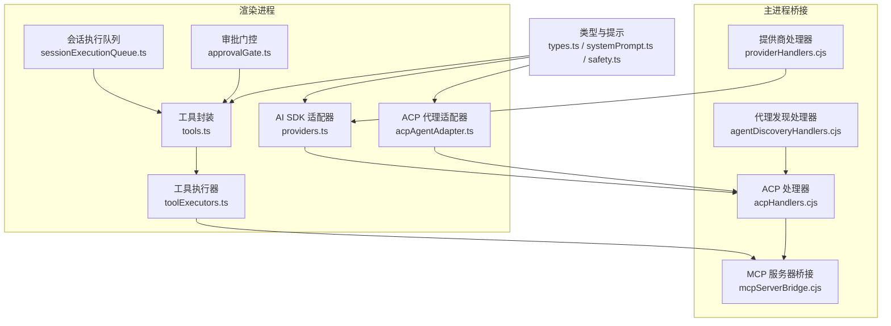
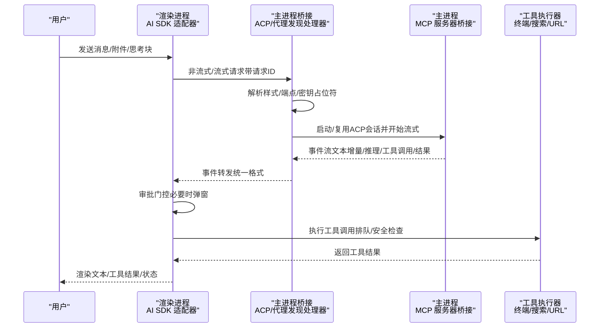
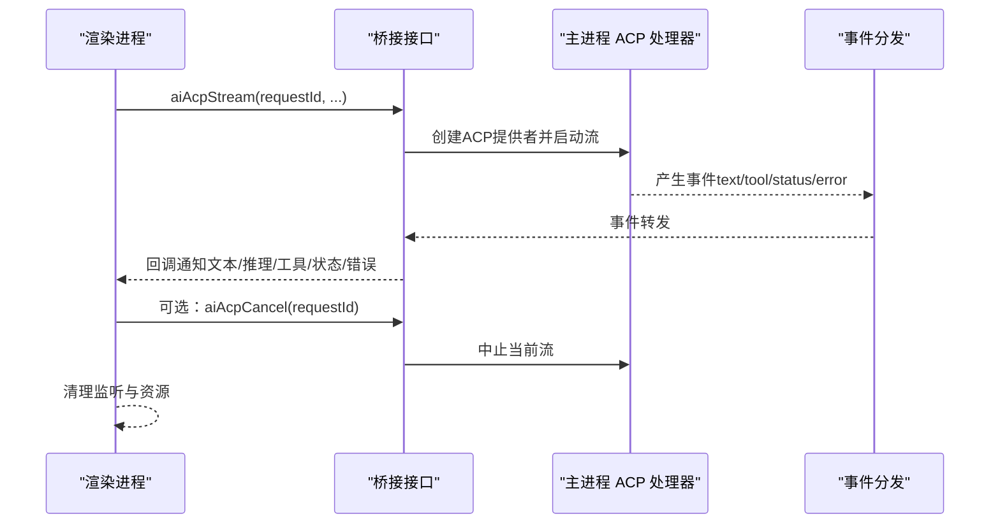
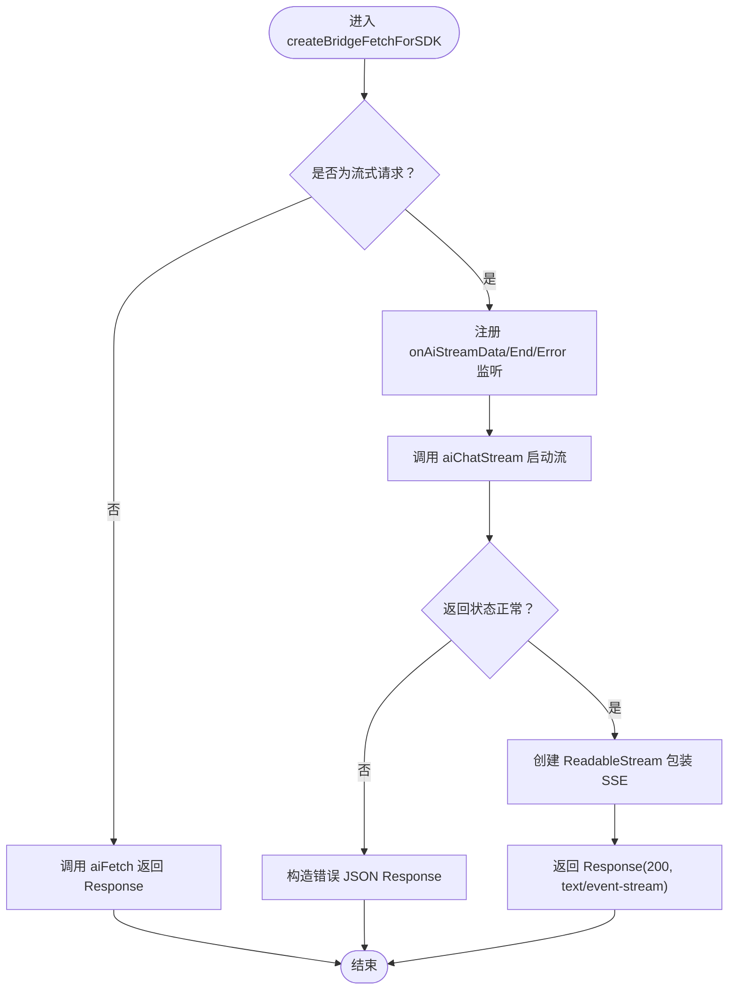
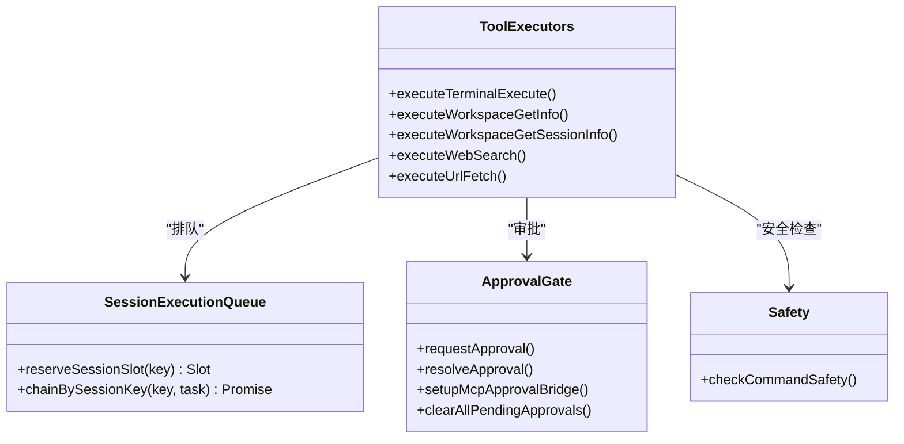
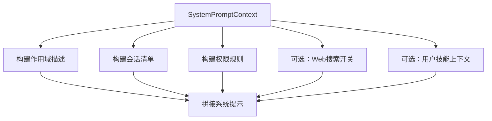
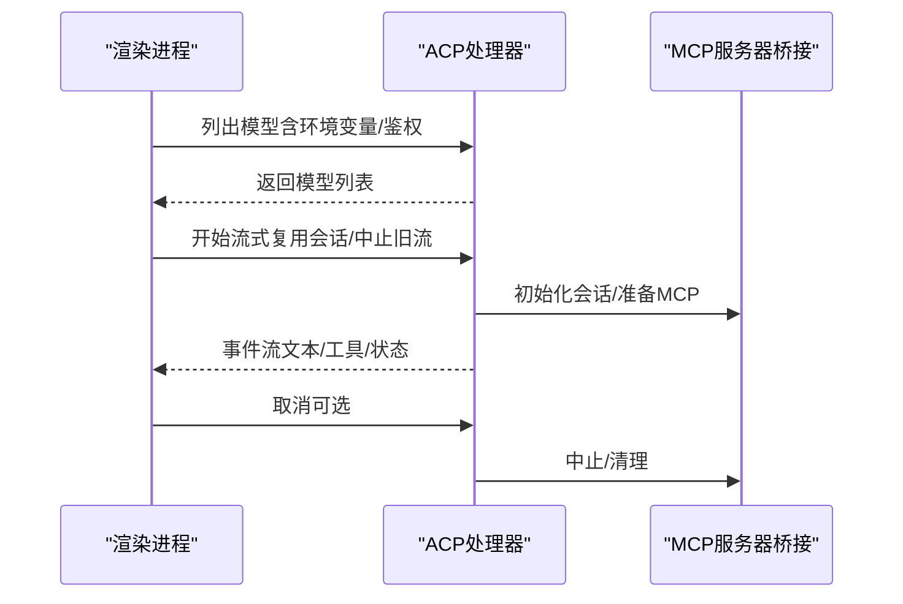
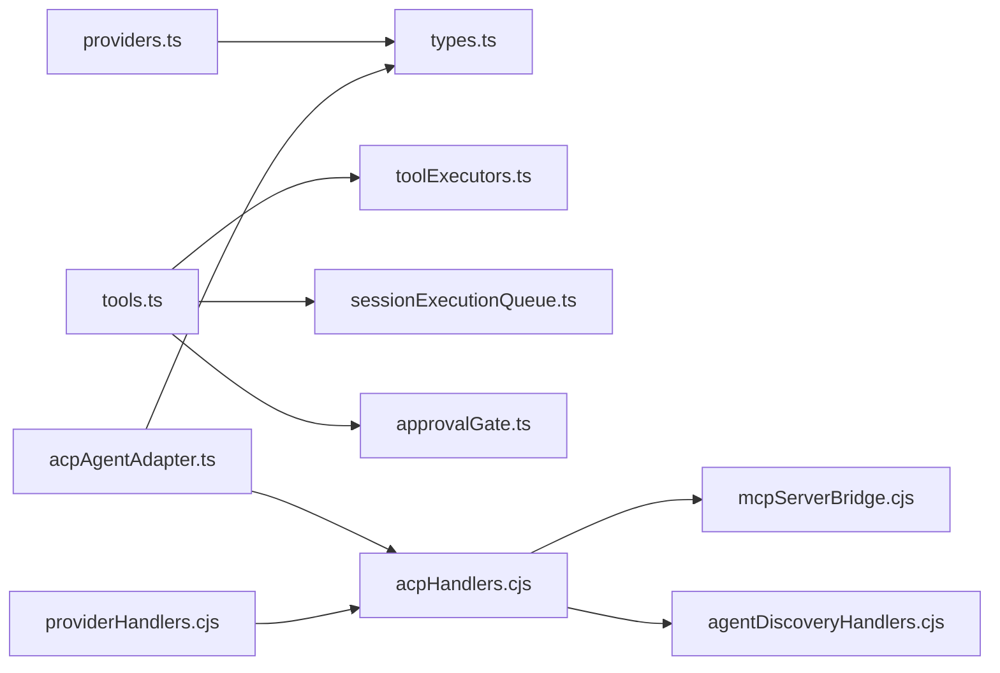

# AI基础设施

<cite>
**本文引用的文件**
- [acpAgentAdapter.ts](file://infrastructure/ai/acpAgentAdapter.ts)
- [managedAgents.ts](file://infrastructure/ai/managedAgents.ts)
- [sessionExecutionQueue.ts](file://infrastructure/ai/shared/sessionExecutionQueue.ts)
- [tools.ts](file://infrastructure/ai/sdk/tools.ts)
- [providers.ts](file://infrastructure/ai/sdk/providers.ts)
- [toolExecutors.ts](file://infrastructure/ai/shared/toolExecutors.ts)
- [approvalGate.ts](file://infrastructure/ai/shared/approvalGate.ts)
- [types.ts](file://infrastructure/ai/types.ts)
- [systemPrompt.ts](file://infrastructure/ai/cattyAgent/systemPrompt.ts)
- [safety.ts](file://infrastructure/ai/cattyAgent/safety.ts)
- [acpHandlers.cjs](file://electron/bridges/aiBridge/acpHandlers.cjs)
- [agentDiscoveryHandlers.cjs](file://electron/bridges/aiBridge/agentDiscoveryHandlers.cjs)
- [providerHandlers.cjs](file://electron/bridges/aiBridge/providerHandlers.cjs)
- [mcpServerBridge.cjs](file://electron/bridges/mcpServerBridge.cjs)
- [logger.ts](file://lib/logger.ts)
- [errorClassifier.ts](file://infrastructure/ai/errorClassifier.ts)
- [netcatty-bridge-ai.d.ts](file://types/global/netcatty-bridge-ai.d.ts)
</cite>

## 目录
1. [简介](#简介)
2. [项目结构](#项目结构)
3. [核心组件](#核心组件)
4. [架构总览](#架构总览)
5. [详细组件分析](#详细组件分析)
6. [依赖关系分析](#依赖关系分析)
7. [性能考量](#性能考量)
8. [故障排查指南](#故障排查指南)
9. [结论](#结论)
10. [附录](#附录)

## 简介
本文件面向Netcatty的AI基础设施，系统化阐述AI代理管理器的设计与实现，覆盖代理发现与匹配、生命周期与并发控制、AI SDK集成（Claude、OpenAI等）、共享服务（会话执行队列、工具执行器、安全控制、输出解析）以及端到端的AI服务架构。文档同时提供关键流程的时序图与类图，帮助读者快速理解从用户请求到AI响应的全链路。

**更新** 本版本新增了对CodeBuddy Code AI代理的支持，包括代理发现机制、命令识别和元数据管理。

## 项目结构
Netcatty的AI基础设施主要由以下层次构成：
- 基础设施层（infrastructure/ai）
  - ACP代理适配器：桥接外部支持ACP协议的代理，负责事件转发与错误格式化。
  - SDK适配层：提供对Vercel AI SDK的fetch封装、模型创建与流式处理。
  - 共享服务：工具执行器、会话执行队列、审批门控、Web搜索提供者。
  - 类型与提示：统一的类型定义、系统提示构建、命令安全策略。
- 主进程桥接层（electron/bridges）
  - ACP处理器：负责启动/取消ACP流、模型枚举、会话复用与清理。
  - 代理发现处理器：扫描系统中的外部AI代理，包括CodeBuddy、Claude、Codex、Copilot等。
  - 提供商处理器：配置同步、主机白名单、密钥注入与临时放行。
  - MCP服务器桥接：CLI发现文件写入、会话互斥与命令阻断。
- 日志与错误分类（lib/logger.ts, infrastructure/ai/errorClassifier.ts）
  - 调试日志与错误分类，辅助定位网络/认证/超时等问题。

**图表来源**
- [providers.ts:1-478](file://infrastructure/ai/sdk/providers.ts#L1-L478)
- [tools.ts:1-177](file://infrastructure/ai/sdk/tools.ts#L1-L177)
- [sessionExecutionQueue.ts:1-128](file://infrastructure/ai/shared/sessionExecutionQueue.ts#L1-L128)
- [approvalGate.ts:1-261](file://infrastructure/ai/shared/approvalGate.ts#L1-L261)
- [toolExecutors.ts:1-240](file://infrastructure/ai/shared/toolExecutors.ts#L1-L240)
- [acpAgentAdapter.ts:1-323](file://infrastructure/ai/acpAgentAdapter.ts#L1-L323)
- [acpHandlers.cjs:1-200](file://electron/bridges/aiBridge/acpHandlers.cjs#L1-L200)
- [agentDiscoveryHandlers.cjs:1-200](file://electron/bridges/aiBridge/agentDiscoveryHandlers.cjs#L1-L200)
- [providerHandlers.cjs:1-200](file://electron/bridges/aiBridge/providerHandlers.cjs#L1-L200)
- [mcpServerBridge.cjs:235-269](file://electron/bridges/mcpServerBridge.cjs#L235-L269)
- [types.ts:1-348](file://infrastructure/ai/types.ts#L1-L348)
- [systemPrompt.ts:1-142](file://infrastructure/ai/cattyAgent/systemPrompt.ts#L1-L142)
- [safety.ts:1-99](file://infrastructure/ai/cattyAgent/safety.ts#L1-L99)

**章节来源**
- [providers.ts:1-478](file://infrastructure/ai/sdk/providers.ts#L1-L478)
- [tools.ts:1-177](file://infrastructure/ai/sdk/tools.ts#L1-L177)
- [sessionExecutionQueue.ts:1-128](file://infrastructure/ai/shared/sessionExecutionQueue.ts#L1-L128)
- [approvalGate.ts:1-261](file://infrastructure/ai/shared/approvalGate.ts#L1-L261)
- [toolExecutors.ts:1-240](file://infrastructure/ai/shared/toolExecutors.ts#L1-L240)
- [acpAgentAdapter.ts:1-323](file://infrastructure/ai/acpAgentAdapter.ts#L1-L323)
- [acpHandlers.cjs:1-200](file://electron/bridges/aiBridge/acpHandlers.cjs#L1-L200)
- [agentDiscoveryHandlers.cjs:1-200](file://electron/bridges/aiBridge/agentDiscoveryHandlers.cjs#L1-L200)
- [providerHandlers.cjs:1-200](file://electron/bridges/aiBridge/providerHandlers.cjs#L1-L200)
- [mcpServerBridge.cjs:235-269](file://electron/bridges/mcpServerBridge.cjs#L235-L269)
- [types.ts:1-348](file://infrastructure/ai/types.ts#L1-L348)
- [systemPrompt.ts:1-142](file://infrastructure/ai/cattyAgent/systemPrompt.ts#L1-L142)
- [safety.ts:1-99](file://infrastructure/ai/cattyAgent/safety.ts#L1-L99)

## 核心组件
- ACP代理适配器：在渲染进程中通过桥接接口启动ACP流、监听事件、处理中止与错误，并将事件映射为统一的回调。
- SDK适配层：提供fetch桥接以绕过CORS限制，封装流式与非流式请求，统一工具调用的输入/输出格式。
- 工具执行器：封装终端执行、工作区信息查询、Web搜索与URL抓取等能力，统一返回结果结构。
- 会话执行队列：按会话键串行化工具调用，避免PTTY并发冲突导致的"部分失败"问题。
- 审批门控：统一的工具执行审批系统，支持超时自动拒绝与跨会话清理。
- 安全与提示：命令安全检查（防ReDoS与阻断列表），系统提示构建（权限模式、范围、设备差异）。
- 主进程桥接：ACP流控制、代理发现与配置同步、提供商配置同步与主机白名单、MCP会话互斥与CLI发现。
- **代理发现与管理**：支持多种外部AI代理的自动发现、命令识别与元数据管理，包括新增的CodeBuddy代理。

**更新** 新增了对CodeBuddy Code AI代理的完整支持，包括代理发现、命令识别和元数据管理。

**章节来源**
- [acpAgentAdapter.ts:1-323](file://infrastructure/ai/acpAgentAdapter.ts#L1-L323)
- [providers.ts:1-478](file://infrastructure/ai/sdk/providers.ts#L1-L478)
- [tools.ts:1-177](file://infrastructure/ai/sdk/tools.ts#L1-L177)
- [toolExecutors.ts:1-240](file://infrastructure/ai/shared/toolExecutors.ts#L1-L240)
- [sessionExecutionQueue.ts:1-128](file://infrastructure/ai/shared/sessionExecutionQueue.ts#L1-L128)
- [approvalGate.ts:1-261](file://infrastructure/ai/shared/approvalGate.ts#L1-L261)
- [systemPrompt.ts:1-142](file://infrastructure/ai/cattyAgent/systemPrompt.ts#L1-L142)
- [safety.ts:1-99](file://infrastructure/ai/cattyAgent/safety.ts#L1-L99)

## 架构总览
下图展示了从用户请求到AI响应的端到端流程，涵盖请求路由、上下文管理、流式响应处理与工具调用安全边界。

**图表来源**
- [providers.ts:247-399](file://infrastructure/ai/sdk/providers.ts#L247-L399)
- [acpHandlers.cjs:123-200](file://electron/bridges/aiBridge/acpHandlers.cjs#L123-L200)
- [mcpServerBridge.cjs:235-269](file://electron/bridges/mcpServerBridge.cjs#L235-L269)
- [toolExecutors.ts:66-116](file://infrastructure/ai/shared/toolExecutors.ts#L66-L116)
- [approvalGate.ts:53-89](file://infrastructure/ai/shared/approvalGate.ts#L53-L89)

**章节来源**
- [providers.ts:1-478](file://infrastructure/ai/sdk/providers.ts#L1-L478)
- [acpHandlers.cjs:1-200](file://electron/bridges/aiBridge/acpHandlers.cjs#L1-L200)
- [mcpServerBridge.cjs:235-269](file://electron/bridges/mcpServerBridge.cjs#L235-L269)
- [toolExecutors.ts:1-240](file://infrastructure/ai/shared/toolExecutors.ts#L1-L240)
- [approvalGate.ts:1-261](file://infrastructure/ai/shared/approvalGate.ts#L1-L261)

## 详细组件分析

### ACP代理适配器（ACPAgentAdapter）
- 设计目标：桥接外部支持ACP协议的代理，通过IPC将流事件回传至渲染进程；统一错误格式化与事件类型映射。
- 关键职责
  - 启动ACP流：在主进程侧调用`createACPProvider`与`streamText`，并将事件通过IPC转发。
  - 事件处理：将流事件映射为文本增量、推理增量/结束、工具调用、工具结果、状态、会话ID与错误。
  - 中止与清理：支持AbortSignal触发中止，确保事件监听与桥接调用正确清理。
  - 错误格式化：递归提取错误信息中的可读字段，避免循环引用与不可读对象。
- 并发与生命周期
  - 使用一次性事件监听注册，避免重复订阅。
  - settle函数保证完成/错误回调只触发一次，防止竞态。
  - 支持请求ID隔离，避免多会话互相干扰。

**图表来源**
- [acpAgentAdapter.ts:132-249](file://infrastructure/ai/acpAgentAdapter.ts#L132-L249)
- [acpHandlers.cjs:123-200](file://electron/bridges/aiBridge/acpHandlers.cjs#L123-L200)

**章节来源**
- [acpAgentAdapter.ts:1-323](file://infrastructure/ai/acpAgentAdapter.ts#L1-L323)
- [acpHandlers.cjs:1-200](file://electron/bridges/aiBridge/acpHandlers.cjs#L1-L200)

### AI SDK集成（Claude、OpenAI、Google等）
- 统一fetch桥接
  - 检测是否为流式请求（基于body中的stream标志）。
  - 非流式：使用`aiFetch`返回Response；流式：使用`aiChatStream`建立SSE流，包装为ReadableStream。
  - 通过占位符API Key（`__IPC_SECURED__`）让SDK生成正确头部，主进程替换为真实密钥。
- 流式事件规范化
  - 对OpenAI兼容流进行字段捕获与工具调用ID规范化，确保工具调用顺序与ID稳定。
  - 在事件到达时先进行标准化再转发，避免SDK解析异常。
- 模型创建
  - 根据ProviderStyle选择对应客户端（OpenAI/Anthropic/Google）。
  - 特殊端点处理：如Ollama、OpenRouter的默认baseURL与apiKey策略。
- 请求上下文
  - 支持OpenAI Chat Assistant Fields的延续合并，保证多片段流式响应的完整性。

**图表来源**
- [providers.ts:247-399](file://infrastructure/ai/sdk/providers.ts#L247-L399)

**章节来源**
- [providers.ts:1-478](file://infrastructure/ai/sdk/providers.ts#L1-L478)

### 工具执行器与安全控制
- 工具封装
  - terminal_execute：按会话键排队，执行前进行权限与安全检查，支持AbortSignal重发取消。
  - workspace_get_info / workspace_get_session_info：读取上下文信息。
  - web_search / url_fetch：条件可用时启用，读操作不需审批。
- 会话执行队列
  - 以`{chatSessionId}:{sessionId}`为键，保证同一会话内工具调用串行化。
  - 支持预占位槽位（reserveSessionSlot）与ready释放，确保LLM发射顺序与实际执行顺序一致。
- 审批门控
  - requestApproval：UI弹窗或MCP审批，超时自动拒绝；支持重放与按会话清理。
  - setupMcpApprovalBridge：接收主进程IPC审批请求，统一UI处理。
- 安全策略
  - 命令安全检查：默认阻断列表预编译缓存，用户自定义规则安全正则校验（ReDoS防护）。
  - 网络设备/串口会话：跳过Shell阻断列表，避免对CLI行为的误判。

**图表来源**
- [toolExecutors.ts:66-240](file://infrastructure/ai/shared/toolExecutors.ts#L66-L240)
- [sessionExecutionQueue.ts:58-117](file://infrastructure/ai/shared/sessionExecutionQueue.ts#L58-L117)
- [approvalGate.ts:53-185](file://infrastructure/ai/shared/approvalGate.ts#L53-L185)
- [safety.ts:76-99](file://infrastructure/ai/cattyAgent/safety.ts#L76-L99)

**章节来源**
- [toolExecutors.ts:1-240](file://infrastructure/ai/shared/toolExecutors.ts#L1-L240)
- [sessionExecutionQueue.ts:1-128](file://infrastructure/ai/shared/sessionExecutionQueue.ts#L1-L128)
- [approvalGate.ts:1-261](file://infrastructure/ai/shared/approvalGate.ts#L1-L261)
- [safety.ts:1-99](file://infrastructure/ai/cattyAgent/safety.ts#L1-L99)

### 系统提示与上下文管理
- 系统提示构建
  - 动态注入当前作用域（单会话/工作区/全局）、可用会话列表、权限模式规则。
  - 网络设备与串口会话的特殊指导（无退出码、禁用Shell语法、建议关闭分页等）。
  - 可选Web搜索与用户技能上下文注入。
- 上下文类型
  - ProviderStyle与ProviderConfig：统一风格与端点解析。
  - AISession/AISessionScope：会话与作用域建模。
  - ChatMessage/ToolCall/ToolResult：消息与工具调用的结构化表示。

**图表来源**
- [systemPrompt.ts:20-65](file://infrastructure/ai/cattyAgent/systemPrompt.ts#L20-L65)
- [types.ts:160-177](file://infrastructure/ai/types.ts#L160-L177)

**章节来源**
- [systemPrompt.ts:1-142](file://infrastructure/ai/cattyAgent/systemPrompt.ts#L1-L142)
- [types.ts:1-348](file://infrastructure/ai/types.ts#L1-L348)

### 主进程桥接与并发控制
- ACP处理器
  - 模型枚举与流式启动：根据代理命令解析二进制路径与环境变量，初始化会话并返回模型列表。
  - 会话复用与中断：同一chatSessionId下，若已有活跃流则中止旧流并复用会话，保持对话连续性。
  - 清理策略：瞬时模型枚举实例在完成后清理，Copilot专用COPILOT_HOME临时目录清理。
  - **命令识别增强**：新增对CodeBuddy代理的命令识别支持，通过`matchesAgentCommand(acpCommand, "codebuddy")`进行精确匹配。
- 提供商处理器
  - 配置同步：加密密钥与baseURL动态重建主机白名单。
  - 临时放行：为设置面板模型拉取临时添加主机/端口白名单，定时清理。
- MCP服务器桥接
  - CLI发现文件：暴露TCP端口与令牌，供外部CLI发现与连接。
  - 会话互斥：防御LLM路径与其他IPC路径的并发冲突，作为第二道防线。

**图表来源**
- [acpHandlers.cjs:4-121](file://electron/bridges/aiBridge/acpHandlers.cjs#L4-L121)
- [acpHandlers.cjs:123-200](file://electron/bridges/aiBridge/acpHandlers.cjs#L123-L200)
- [mcpServerBridge.cjs:245-269](file://electron/bridges/mcpServerBridge.cjs#L245-L269)

**章节来源**
- [acpHandlers.cjs:1-200](file://electron/bridges/aiBridge/acpHandlers.cjs#L1-L200)
- [providerHandlers.cjs:1-200](file://electron/bridges/aiBridge/providerHandlers.cjs#L1-L200)
- [mcpServerBridge.cjs:235-269](file://electron/bridges/mcpServerBridge.cjs#L235-L269)

### 代理发现与匹配
- 管理代理元数据：内置codex/claude/copilot/codebuddy的命令名与ACP命令映射。
- 命令基名匹配：支持以命令基名为准的匹配，兼容不同发行版本命名。
- 存储路径获取：优先选择带路径且匹配主命令的已发现代理，否则回退到匹配项。
- **新增CodeBuddy支持**：在代理发现配置中新增CodeBuddy代理条目，包括命令名称、ACP命令、参数和描述信息。

**更新** 新增了对CodeBuddy Code AI代理的完整支持，包括代理发现、命令识别和元数据管理。

**章节来源**
- [managedAgents.ts:1-78](file://infrastructure/ai/managedAgents.ts#L1-L78)
- [agentDiscoveryHandlers.cjs:36-44](file://electron/bridges/aiBridge/agentDiscoveryHandlers.cjs#L36-L44)

### 代理发现处理器
- **代理扫描**：扫描系统中的外部AI代理，包括CodeBuddy、Claude、Codex、Copilot等。
- **路径解析**：解析CLI二进制路径，支持自动检测或自定义路径配置。
- **版本探测**：探测代理版本信息，验证代理可用性。
- **配置管理**：管理代理的可用性状态、版本信息和配置选项。

**更新** 新增了对CodeBuddy代理的发现和配置支持。

**章节来源**
- [agentDiscoveryHandlers.cjs:4-141](file://electron/bridges/aiBridge/agentDiscoveryHandlers.cjs#L4-L141)

## 依赖关系分析
- 渲染进程内部耦合
  - SDK适配器依赖桥接接口与类型系统；工具封装依赖会话执行队列与审批门控；工具执行器依赖MCP桥接与安全策略。
- 主进程桥接
  - ACP处理器依赖MCP服务器桥接与CLI发现文件；提供商处理器依赖密钥解密与主机白名单；**代理发现处理器依赖shell环境与CLI探测**。
- 外部依赖
  - Vercel AI SDK（OpenAI/Anthropic/Google客户端）、@mcpc-tech/acp-ai-provider、ai包的streamText与step计数。

**图表来源**
- [providers.ts:1-478](file://infrastructure/ai/sdk/providers.ts#L1-L478)
- [tools.ts:1-177](file://infrastructure/ai/sdk/tools.ts#L1-L177)
- [toolExecutors.ts:1-240](file://infrastructure/ai/shared/toolExecutors.ts#L1-L240)
- [sessionExecutionQueue.ts:1-128](file://infrastructure/ai/shared/sessionExecutionQueue.ts#L1-L128)
- [approvalGate.ts:1-261](file://infrastructure/ai/shared/approvalGate.ts#L1-L261)
- [acpAgentAdapter.ts:1-323](file://infrastructure/ai/acpAgentAdapter.ts#L1-L323)
- [acpHandlers.cjs:1-200](file://electron/bridges/aiBridge/acpHandlers.cjs#L1-L200)
- [agentDiscoveryHandlers.cjs:1-200](file://electron/bridges/aiBridge/agentDiscoveryHandlers.cjs#L1-L200)
- [mcpServerBridge.cjs:235-269](file://electron/bridges/mcpServerBridge.cjs#L235-L269)
- [providerHandlers.cjs:1-200](file://electron/bridges/aiBridge/providerHandlers.cjs#L1-L200)
- [types.ts:1-348](file://infrastructure/ai/types.ts#L1-L348)

**章节来源**
- [providers.ts:1-478](file://infrastructure/ai/sdk/providers.ts#L1-L478)
- [tools.ts:1-177](file://infrastructure/ai/sdk/tools.ts#L1-L177)
- [toolExecutors.ts:1-240](file://infrastructure/ai/shared/toolExecutors.ts#L1-L240)
- [sessionExecutionQueue.ts:1-128](file://infrastructure/ai/shared/sessionExecutionQueue.ts#L1-L128)
- [approvalGate.ts:1-261](file://infrastructure/ai/shared/approvalGate.ts#L1-L261)
- [acpAgentAdapter.ts:1-323](file://infrastructure/ai/acpAgentAdapter.ts#L1-L323)
- [acpHandlers.cjs:1-200](file://electron/bridges/aiBridge/acpHandlers.cjs#L1-L200)
- [agentDiscoveryHandlers.cjs:1-200](file://electron/bridges/aiBridge/agentDiscoveryHandlers.cjs#L1-L200)
- [mcpServerBridge.cjs:235-269](file://electron/bridges/mcpServerBridge.cjs#L235-L269)
- [providerHandlers.cjs:1-200](file://electron/bridges/aiBridge/providerHandlers.cjs#L1-L200)
- [types.ts:1-348](file://infrastructure/ai/types.ts#L1-L348)

## 性能考量
- 流式处理
  - 使用SSE包装与TextEncoder，减少内存拷贝；仅在事件到达时enqueue，避免提前缓冲。
  - 对OpenAI流进行工具调用ID规范化，降低SDK解析开销与重试成本。
- 并发与串行化
  - 会话级执行队列避免PTTY并发冲突，减少"部分失败"与重试风暴。
  - 预占位槽位确保LLM发射顺序与执行顺序一致，提升一致性体验。
- 缓存与预编译
  - 默认阻断列表预编译，用户自定义规则缓存，降低正则匹配成本。
- 主机白名单与临时放行
  - 提供商配置变更后重建白名单，临时条目定时清理，避免长期膨胀。
- **代理发现优化**：代理扫描结果缓存，避免重复探测相同路径。

**更新** 新增了代理发现的性能优化考虑。

## 故障排查指南
- 错误分类
  - 413请求过大：检测HTML拦截页面与原始响应，提示调整代理限制或减少负载。
  - 502/503/504网关错误：上游服务不可达或超时，建议重试与检查代理配置。
  - HTML错误页：常见于代理拦截或上游服务异常，建议检查鉴权与服务状态。
- 日志与调试
  - 开发环境下启用logger.debug/info/warn/error，便于定位SDK桥接与主进程交互问题。
- 常见问题
  - 工具调用被拒：检查权限模式与审批门控；确认会话ID有效且在当前作用域内。
  - 命令被阻断：核对阻断列表与正则安全性；网络设备会话跳过Shell阻断列表。
  - ACP流中断：确认主进程未提前销毁会话；必要时重新发起请求并等待会话复用。
  - **CodeBuddy代理问题**：检查codebuddy命令是否在PATH中，验证代理版本和配置。

**更新** 新增了CodeBuddy代理相关的故障排查指导。

**章节来源**
- [errorClassifier.ts:121-156](file://infrastructure/ai/errorClassifier.ts#L121-L156)
- [logger.ts:1-25](file://lib/logger.ts#L1-L25)
- [toolExecutors.ts:66-116](file://infrastructure/ai/shared/toolExecutors.ts#L66-L116)
- [safety.ts:76-99](file://infrastructure/ai/cattyAgent/safety.ts#L76-L99)

## 结论
Netcatty的AI基础设施通过"渲染进程SDK适配 + 主进程桥接 + 共享服务"的分层设计，在保证安全与合规的前提下，提供了高扩展性的AI代理与工具调用能力。ACP适配器与SDK桥接共同实现了跨提供商的统一流式体验；会话执行队列与审批门控确保了并发安全与用户体验；系统提示与安全策略则在语义层面强化了任务导向与边界控制。

**更新** 本版本新增了对CodeBuddy Code AI代理的完整支持，包括代理发现、命令识别、元数据管理和配置界面。代理发现处理器能够自动扫描系统中的CodeBuddy代理，命令识别机制支持精确的代理匹配，而管理代理元数据则提供了完整的代理配置信息。

整体架构既满足现有Claude、OpenAI、Google等提供商的集成需求，也为新提供商接入与自定义工具开发预留了清晰的扩展路径。新增的CodeBuddy支持进一步丰富了Netcatty的AI代理生态系统，为用户提供了更多样化的编程助手选择。

## 附录
- 扩展性设计要点
  - 新提供商接入：通过ProviderStyle与resolveProviderEndpoint扩展端点与apiKey策略；在SDK适配器中新增对应客户端分支。
  - 自定义工具开发：遵循ToolExecResult规范，复用会话执行队列与审批门控；在工具封装中声明参数Schema与描述。
  - 插件化架构：通过外部代理（ACP）与MCP桥接，允许第三方CLI以统一协议接入，无需修改核心逻辑。
  - **代理扩展**：新增代理支持时，需要在代理发现配置、命令识别逻辑和管理元数据中相应更新。

**更新** 新增了代理扩展的相关设计要点。