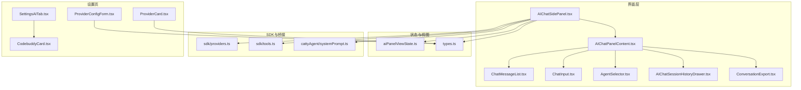
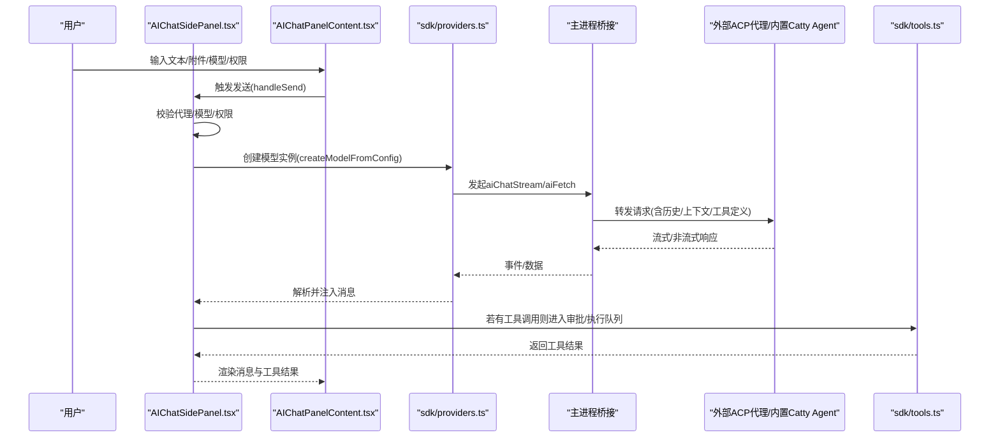
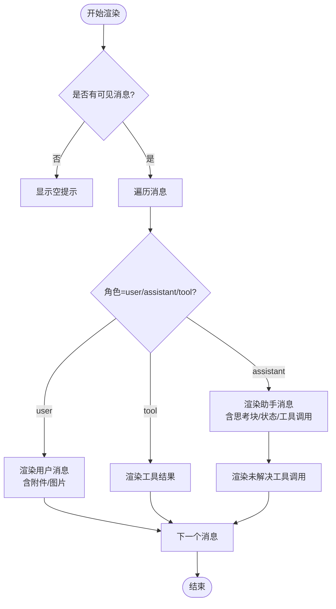
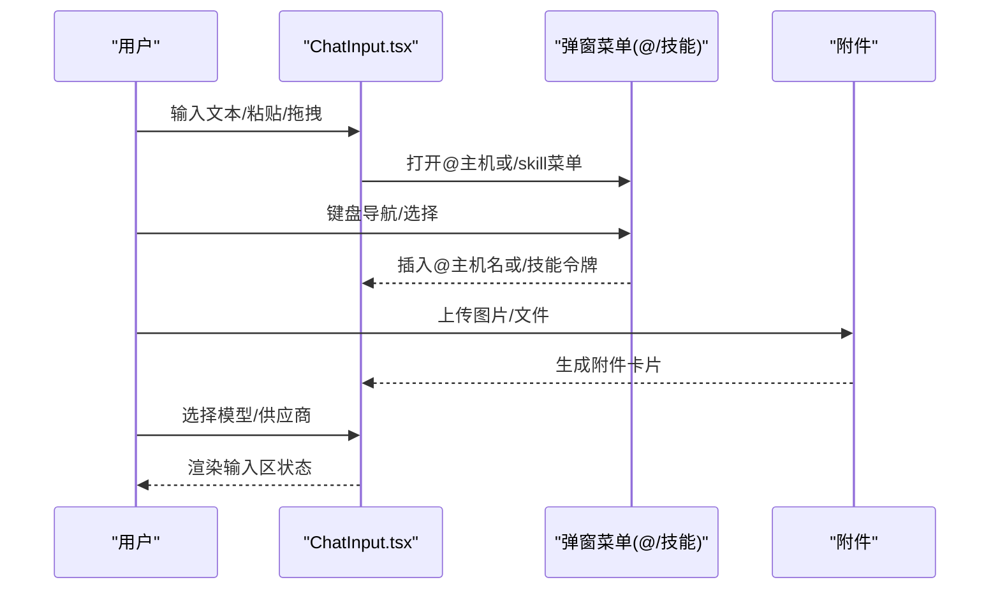
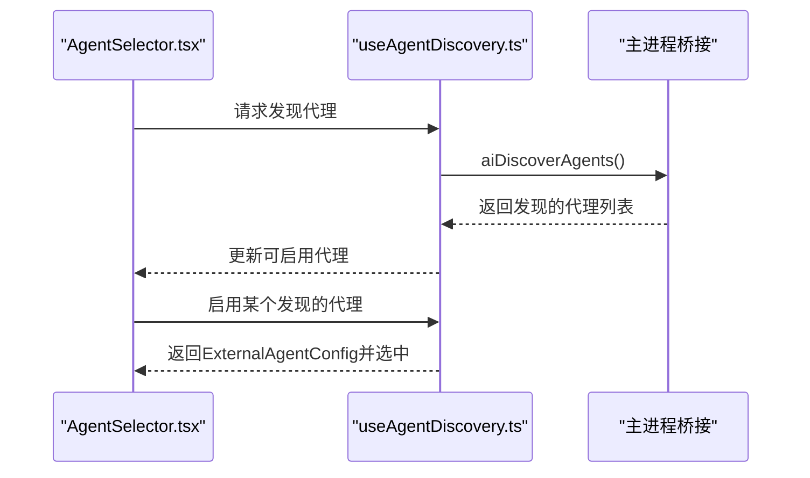
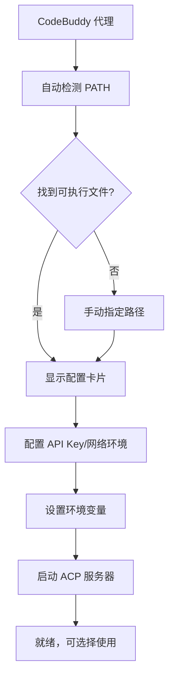
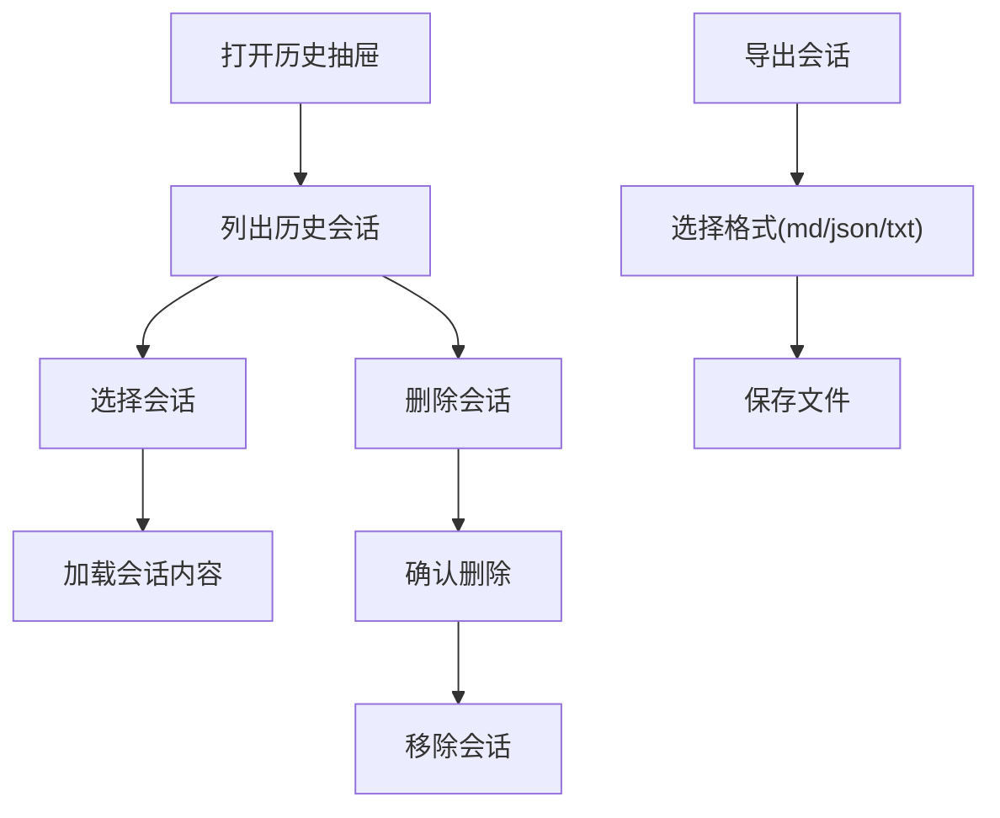
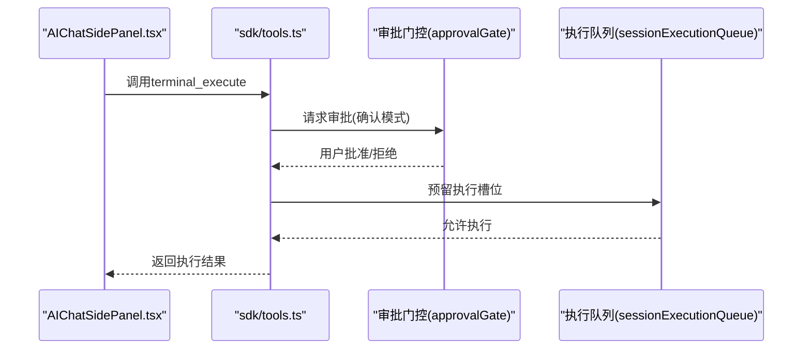
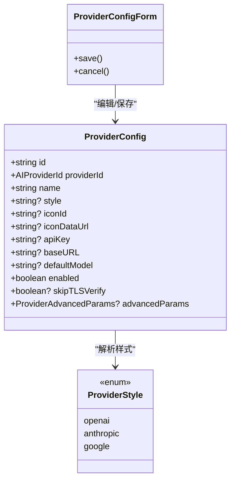
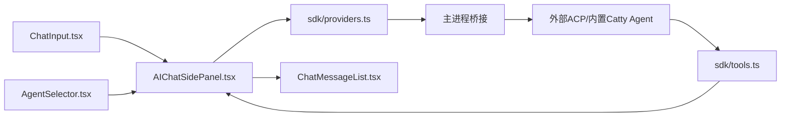

# AI代理集成

<cite>
**本文引用的文件**
- [AIChatPanelContent.tsx](file://components/AIChatPanelContent.tsx)
- [AIChatSidePanel.tsx](file://components/AIChatSidePanel.tsx)
- [ChatMessageList.tsx](file://components/ai/ChatMessageList.tsx)
- [ChatInput.tsx](file://components/ai/ChatInput.tsx)
- [AgentSelector.tsx](file://components/ai/AgentSelector.tsx)
- [ConversationExport.tsx](file://components/ai/ConversationExport.tsx)
- [AIChatSessionHistoryDrawer.tsx](file://components/AIChatSessionHistoryDrawer.tsx)
- [aiPanelViewState.ts](file://components/ai/aiPanelViewState.ts)
- [types.ts](file://infrastructure/ai/types.ts)
- [providers.ts](file://infrastructure/ai/sdk/providers.ts)
- [tools.ts](file://infrastructure/ai/sdk/tools.ts)
- [systemPrompt.ts](file://infrastructure/ai/cattyAgent/systemPrompt.ts)
- [ProviderConfigForm.tsx](file://components/settings/tabs/ai/ProviderConfigForm.tsx)
- [ProviderCard.tsx](file://components/settings/tabs/ai/ProviderCard.tsx)
- [useAgentDiscovery.ts](file://application/state/useAgentDiscovery.ts)
- [SettingsAITab.tsx](file://components/settings/tabs/SettingsAITab.tsx)
- [CodebuddyCard.tsx](file://components/settings/tabs/ai/CodebuddyCard.tsx)
- [codebuddyConfigEnv.ts](file://components/settings/tabs/ai/codebuddyConfigEnv.ts)
- [acpHandlers.cjs](file://electron/bridges/aiBridge/acpHandlers.cjs)
- [agentDiscoveryHandlers.cjs](file://electron/bridges/aiBridge/agentDiscoveryHandlers.cjs)
- [ai.ts](file://application/i18n/locales/zh-CN/ai.ts)
</cite>

## 目录
1. [简介](#简介)
2. [项目结构](#项目结构)
3. [核心组件](#核心组件)
4. [架构总览](#架构总览)
5. [组件详解](#组件详解)
6. [依赖关系分析](#依赖关系分析)
7. [性能与可用性](#性能与可用性)
8. [故障排除指南](#故障排除指南)
9. [结论](#结论)
10. [附录：最佳实践与常见问题](#附录最佳实践与常见问题)

## 简介
本指南面向使用者与运维人员，系统讲解 Netcatty 中的 AI 代理集成功能，涵盖以下主题：
- AI 聊天面板的使用：对话界面、消息历史、会话管理
- AI 代理选择与配置：内置 Catty Agent 与外部 ACP 代理（如 Claude、Codex、CodeBuddy、Copilot 等）
- 自然语言交互模式：多主机操作指令、任务执行、上下文理解
- AI 工具调用：终端命令执行、工作区信息查询、网络搜索、URL 抓取
- 会话历史管理：查看、导出、删除
- 最佳实践：提示词编写、多轮对话技巧、结果验证
- 常见问题与故障排除

## 项目结构
AI 集成由"侧边栏聊天面板 + 设置页 + SDK 适配层 + 主进程桥接"构成，UI 层负责输入、渲染与交互；SDK 层负责将请求路由到主进程桥接以规避跨域；主进程桥接再转发至具体大模型或外部 ACP 代理。

**图表来源**
- [AIChatSidePanel.tsx:48-909](file://components/AIChatSidePanel.tsx#L48-L909)
- [AIChatPanelContent.tsx:1-249](file://components/AIChatPanelContent.tsx#L1-L249)
- [ChatMessageList.tsx:1-468](file://components/ai/ChatMessageList.tsx#L1-L468)
- [ChatInput.tsx:1-955](file://components/ai/ChatInput.tsx#L1-L955)
- [AgentSelector.tsx:1-300](file://components/ai/AgentSelector.tsx#L1-L300)
- [AIChatSessionHistoryDrawer.tsx:1-113](file://components/AIChatSessionHistoryDrawer.tsx#L1-L113)
- [ConversationExport.tsx:1-88](file://components/ai/ConversationExport.tsx#L1-L88)
- [aiPanelViewState.ts:1-95](file://components/ai/aiPanelViewState.ts#L1-L95)
- [types.ts:1-344](file://infrastructure/ai/types.ts#L1-L344)
- [providers.ts:1-478](file://infrastructure/ai/sdk/providers.ts#L1-L478)
- [tools.ts:1-177](file://infrastructure/ai/sdk/tools.ts#L1-L177)
- [systemPrompt.ts:1-142](file://infrastructure/ai/cattyAgent/systemPrompt.ts#L1-L142)
- [ProviderConfigForm.tsx:1-461](file://components/settings/tabs/ai/ProviderConfigForm.tsx#L1-L461)
- [ProviderCard.tsx:1-105](file://components/settings/tabs/ai/ProviderCard.tsx#L1-L105)
- [SettingsAITab.tsx:629-657](file://components/settings/tabs/SettingsAITab.tsx#L629-L657)
- [CodebuddyCard.tsx:1-186](file://components/settings/tabs/ai/CodebuddyCard.tsx#L1-L186)

**章节来源**
- [AIChatSidePanel.tsx:48-909](file://components/AIChatSidePanel.tsx#L48-L909)
- [AIChatPanelContent.tsx:1-249](file://components/AIChatPanelContent.tsx#L1-L249)
- [types.ts:1-344](file://infrastructure/ai/types.ts#L1-L344)

## 核心组件
- 侧边栏聊天面板：承载会话、输入、代理选择、历史抽屉、导出等入口
- 消息列表：渲染用户/助手/工具调用/思考块/错误状态等
- 输入区：支持文本、附件、@主机提及、/技能令牌、模型/供应商切换
- 代理选择器：内置 Catty Agent 与已启用外部代理，支持发现新代理
- 会话历史抽屉：列出历史会话、支持选择与删除
- 导出：支持 Markdown/JSON/纯文本导出
- SDK 适配：通过桥接发起流式/非流式请求，规范化响应
- 工具集：终端执行、工作区信息、网络搜索、URL 抓取
- 系统提示：根据作用域、主机、权限模式构建系统提示
- **新增** CodeBuddy 代理：第四种受支持的外部 ACP 代理，通过 `codebuddy --acp` 协议工作

**章节来源**
- [AIChatPanelContent.tsx:69-249](file://components/AIChatPanelContent.tsx#L69-L249)
- [ChatMessageList.tsx:37-468](file://components/ai/ChatMessageList.tsx#L37-L468)
- [ChatInput.tsx:101-955](file://components/ai/ChatInput.tsx#L101-L955)
- [AgentSelector.tsx:118-300](file://components/ai/AgentSelector.tsx#L118-L300)
- [AIChatSessionHistoryDrawer.tsx:22-113](file://components/AIChatSessionHistoryDrawer.tsx#L22-L113)
- [ConversationExport.tsx:32-88](file://components/ai/ConversationExport.tsx#L32-L88)
- [providers.ts:247-478](file://infrastructure/ai/sdk/providers.ts#L247-L478)
- [tools.ts:33-177](file://infrastructure/ai/sdk/tools.ts#L33-L177)
- [systemPrompt.ts:20-142](file://infrastructure/ai/cattyAgent/systemPrompt.ts#L20-L142)

## 架构总览
下图展示从用户输入到工具执行与返回的端到端流程，以及 SDK 与主进程桥接的关系。

**图表来源**
- [AIChatSidePanel.tsx:647-798](file://components/AIChatSidePanel.tsx#L647-L798)
- [providers.ts:247-478](file://infrastructure/ai/sdk/providers.ts#L247-L478)
- [tools.ts:33-177](file://infrastructure/ai/sdk/tools.ts#L33-L177)

## 组件详解

### 聊天面板与消息渲染
- 聊天面板布局：顶部代理选择与导出/历史/新建按钮；中部消息列表；底部输入区
- 消息类型：用户消息、助手回复、工具调用、思考块、状态文本、错误信息
- 工具调用显示：在最后一条助手消息后渲染待处理/已批准/已拒绝的工具调用
- 图片/附件：支持图片缩放预览、拖拽/粘贴上传
- 流式渲染：支持"思考中"动画与打字机效果

**图表来源**
- [ChatMessageList.tsx:169-433](file://components/ai/ChatMessageList.tsx#L169-L433)

**章节来源**
- [AIChatPanelContent.tsx:115-248](file://components/AIChatPanelContent.tsx#L115-L248)
- [ChatMessageList.tsx:37-468](file://components/ai/ChatMessageList.tsx#L37-L468)

### 输入区与自然语言交互
- 多功能输入区：展开/收起、@主机提及、/技能令牌插入、附件上传、模型/供应商切换
- 键盘导航：@提及与/skill 弹窗支持上下键选择、回车确认
- 文件粘贴/拖拽：自动识别图片/文件并生成附件卡片
- 权限模式：内置 Catty Agent 的权限模式影响工具调用是否需要审批

**图表来源**
- [ChatInput.tsx:174-336](file://components/ai/ChatInput.tsx#L174-L336)
- [ChatInput.tsx:424-955](file://components/ai/ChatInput.tsx#L424-L955)

**章节来源**
- [ChatInput.tsx:101-955](file://components/ai/ChatInput.tsx#L101-L955)

### 代理选择与外部 ACP 代理
- 内置代理：Catty Agent（终端自动化助手）
- 外部代理：通过系统发现与启用，支持 ACP 协议（如 Claude、Codex、CodeBuddy、Copilot）
- 发现机制：启动时扫描系统 PATH，过滤已配置代理，支持重新扫描
- 启用流程：将发现的代理转换为可启用的 ExternalAgentConfig 并自动选择

**图表来源**
- [AgentSelector.tsx:118-300](file://components/ai/AgentSelector.tsx#L118-L300)
- [useAgentDiscovery.ts:12-108](file://application/state/useAgentDiscovery.ts#L12-L108)

**章节来源**
- [AgentSelector.tsx:118-300](file://components/ai/AgentSelector.tsx#L118-L300)
- [useAgentDiscovery.ts:12-108](file://application/state/useAgentDiscovery.ts#L12-L108)

### CodeBuddy 代理配置与集成
**新增** CodeBuddy 作为第四种受支持的外部 ACP 代理，通过 `codebuddy --acp` 协议工作：

- **发现与识别**：在代理发现列表中识别 `codebuddy` 命令，支持通过 PATH 自动检测或手动指定路径
- **配置界面**：提供专门的 CodeBuddyCard 组件，支持 API Key、网络环境和自定义环境变量配置
- **环境变量管理**：支持 CODEBUDDY_API_KEY 和 CODEBUDDY_INTERNET_ENVIRONMENT 等关键环境变量
- **ACP 协议支持**：通过 `codebuddy --acp` 启动 ACP 服务器，与其他 ACP 代理（Claude、Codex、Copilot）兼容

**图表来源**
- [agentDiscoveryHandlers.cjs:36-44](file://electron/bridges/aiBridge/agentDiscoveryHandlers.cjs#L36-L44)
- [CodebuddyCard.tsx:16-186](file://components/settings/tabs/ai/CodebuddyCard.tsx#L16-L186)
- [codebuddyConfigEnv.ts:8-67](file://components/settings/tabs/ai/codebuddyConfigEnv.ts#L8-L67)

**章节来源**
- [SettingsAITab.tsx:629-657](file://components/settings/tabs/SettingsAITab.tsx#L629-L657)
- [CodebuddyCard.tsx:16-186](file://components/settings/tabs/ai/CodebuddyCard.tsx#L16-L186)
- [codebuddyConfigEnv.ts:8-67](file://components/settings/tabs/ai/codebuddyConfigEnv.ts#L8-L67)
- [agentDiscoveryHandlers.cjs:36-44](file://electron/bridges/aiBridge/agentDiscoveryHandlers.cjs#L36-L44)

### 会话历史与导出
- 历史抽屉：列出按匹配度排序的历史会话，支持选择与删除
- 导出：支持 Markdown/JSON/纯文本三种格式，仅在存在消息时可用
- 自动标题：首次用户消息用于自动命名会话标题

**图表来源**
- [AIChatSessionHistoryDrawer.tsx:22-113](file://components/AIChatSessionHistoryDrawer.tsx#L22-L113)
- [ConversationExport.tsx:32-88](file://components/ai/ConversationExport.tsx#L32-L88)
- [AIChatSidePanel.tsx:589-597](file://components/AIChatSidePanel.tsx#L589-L597)

**章节来源**
- [AIChatSessionHistoryDrawer.tsx:14-113](file://components/AIChatSessionHistoryDrawer.tsx#L14-L113)
- [ConversationExport.tsx:20-88](file://components/ai/ConversationExport.tsx#L20-L88)
- [AIChatSidePanel.tsx:589-597](file://components/AIChatSidePanel.tsx#L589-L597)

### AI 工具调用与系统提示
- 工具集：终端执行、工作区信息、网络搜索、URL 抓取
- 审批与串行化：工具调用在"确认"模式下触发审批；同一会话内串行排队，保证顺序一致性
- 系统提示：根据作用域（单会话/工作区/全局）、主机列表、权限模式、是否启用网络搜索、用户技能上下文动态构建

**图表来源**
- [tools.ts:44-115](file://infrastructure/ai/sdk/tools.ts#L44-L115)
- [systemPrompt.ts:20-142](file://infrastructure/ai/cattyAgent/systemPrompt.ts#L20-L142)

**章节来源**
- [tools.ts:33-177](file://infrastructure/ai/sdk/tools.ts#L33-L177)
- [systemPrompt.ts:1-142](file://infrastructure/ai/cattyAgent/systemPrompt.ts#L1-L142)

### 提供商配置与 SDK 适配
- 提供商类型：OpenAI、Anthropic、Google、Ollama、OpenRouter、自定义
- SDK 适配：通过桥接发起请求，支持流式/非流式；规范化 OpenAI 工具调用 ID、捕获流式字段
- 配置表单：名称、图标、风格、API Key、Base URL、默认模型、跳过 TLS 校验、高级参数、加密存储

**图表来源**
- [types.ts:23-40](file://infrastructure/ai/types.ts#L23-L40)
- [types.ts:43-53](file://infrastructure/ai/types.ts#L43-L53)
- [ProviderConfigForm.tsx:54-173](file://components/settings/tabs/ai/ProviderConfigForm.tsx#L54-L173)

**章节来源**
- [types.ts:1-344](file://infrastructure/ai/types.ts#L1-L344)
- [providers.ts:247-478](file://infrastructure/ai/sdk/providers.ts#L247-L478)
- [ProviderConfigForm.tsx:54-461](file://components/settings/tabs/ai/ProviderConfigForm.tsx#L54-L461)
- [ProviderCard.tsx:11-105](file://components/settings/tabs/ai/ProviderCard.tsx#L11-L105)

## 依赖关系分析
- 组件耦合
  - AIChatSidePanel.tsx 是中枢，协调消息、会话、代理、工具、桥接与视图状态
  - ChatInput.tsx 与 AgentSelector.tsx 通过回调与状态更新与面板联动
  - ChatMessageList.tsx 仅消费消息与状态，低耦合
- 外部依赖
  - Electron 主进程桥接：aiChatStream/aiFetch/aiCattyCancelExec 等
  - Vercel AI SDK：统一 OpenAI/Anthropic/Google 客户端与流式处理
  - **新增** ACP 协议支持：通过 @mcpc-tech/acp-ai-provider 库支持多种 ACP 代理
- 数据流
  - 输入 -> 校验 -> SDK -> 桥接 -> 代理 -> 工具 -> 结果回传 -> 渲染

**图表来源**
- [AIChatSidePanel.tsx:104-116](file://components/AIChatSidePanel.tsx#L104-L116)
- [providers.ts:247-478](file://infrastructure/ai/sdk/providers.ts#L247-L478)
- [tools.ts:33-177](file://infrastructure/ai/sdk/tools.ts#L33-L177)

**章节来源**
- [AIChatSidePanel.tsx:48-909](file://components/AIChatSidePanel.tsx#L48-L909)
- [providers.ts:1-478](file://infrastructure/ai/sdk/providers.ts#L1-L478)
- [tools.ts:1-177](file://infrastructure/ai/sdk/tools.ts#L1-L177)

## 性能与可用性
- 流式渲染：消息增量更新，避免全量重绘
- 附件预览：图片缩放与拖拽平移，减少额外窗口
- 工具串行化：同一会话内串行执行，避免并发冲突
- 会话标题自动命名：首条用户消息截断命名，提升可读性
- 无状态渲染优化：消息列表使用 memo 化比较，降低重渲染
- **新增** CodeBuddy 代理支持：通过 ACP 协议提供高性能的代码辅助能力

## 故障排除指南
- 无法连接/无响应
  - 检查提供商 API Key 是否正确、Base URL 是否可达
  - 若使用自签名证书，可在提供商配置中开启"跳过 TLS 校验"
  - 查看错误信息中的"可重试"标记，必要时重试
- 工具调用被阻断
  - 在"确认"模式下，工具调用会弹出审批；在"观察者"模式下只允许只读工具
  - 检查命令是否命中阻断清单（如危险命令）
- 会话历史为空
  - 新建会话后需至少一条消息才会出现在历史中
  - 删除会话后不可恢复，请谨慎操作
- 外部代理未出现
  - 使用"重新扫描"刷新发现列表
  - 确认代理已在设置中启用并生效
- **新增** CodeBuddy 代理问题
  - 确认已正确安装 codebuddy 并可通过 PATH 访问
  - 检查 API Key 和网络环境配置是否正确
  - 验证 ACP 服务器是否正常启动（查看代理状态指示）

**章节来源**
- [ChatMessageList.tsx:280-292](file://components/ai/ChatMessageList.tsx#L280-L292)
- [AIChatSidePanel.tsx:693-711](file://components/AIChatSidePanel.tsx#L693-L711)
- [useAgentDiscovery.ts:19-32](file://application/state/useAgentDiscovery.ts#L19-L32)

## 结论
Netcatty 的 AI 代理集成功能以清晰的分层设计实现了从 UI 到 SDK、再到主进程桥接与外部代理的完整链路。内置 Catty Agent 提供安全可控的终端自动化能力，外部 ACP 代理（如 Claude、Codex、CodeBuddy、Copilot）扩展了模型与生态。**新增的 CodeBuddy 代理**进一步丰富了代码辅助选项，通过 ACP 协议提供高性能的编程助手能力。配合完善的工具调用、会话历史与导出能力，用户可以高效地进行多主机操作与任务执行。

## 附录：最佳实践与常见问题

### 最佳实践
- 提示词编写
  - 明确任务目标与预期输出，必要时给出步骤编号
  - 对于多步任务，先口头规划再执行
  - 提供上下文（主机标签、协议、设备类型）有助于更准确的操作
- 多轮对话技巧
  - 将复杂任务拆分为多个子任务，逐步推进
  - 对失败的命令进行复盘与替代方案建议
- 结果验证
  - 对写操作（如文件修改）建议先做只读验证（如查看差异）
  - 使用网络搜索验证事实性陈述
- **新增** CodeBuddy 使用建议
  - 根据网络环境选择合适的 CODEBUDDY_INTERNET_ENVIRONMENT
  - 合理配置 API Key 和自定义环境变量
  - 利用 ACP 协议的优势，享受更快的响应速度

### 常见问题
- Q：为什么工具调用需要审批？
  - A：在"确认"模式下，系统会弹出审批卡片，确保用户对潜在风险操作知情
- Q：如何切换模型或供应商？
  - A：在输入区点击模型芯片，选择供应商/模型；或在设置页配置提供商
- Q：如何导出会话？
  - A：点击导出按钮，选择 Markdown/JSON/纯文本格式保存
- Q：如何删除历史会话？
  - A：在历史抽屉中点击删除按钮，确认后移除
- **新增** Q：CodeBuddy 代理如何配置？
  - A：在设置页的 AI 代理配置中，找到 CodeBuddy Code 卡片，配置 API Key、网络环境和自定义环境变量后即可使用
- **新增** Q：CodeBuddy 与其它 ACP 代理有什么区别？
  - A：CodeBuddy 专注于代码辅助和编程场景，支持通过 ACP 协议提供本地化的编程助手体验