# 代理管理

<cite>
**本文引用的文件**
- [AgentSelector.tsx](file://components/ai/AgentSelector.tsx)
- [useAgentDiscovery.ts](file://application/state/useAgentDiscovery.ts)
- [managedAgents.ts](file://infrastructure/ai/managedAgents.ts)
- [types.ts](file://infrastructure/ai/types.ts)
- [managedAgentState.ts](file://components/settings/tabs/ai/managedAgentState.ts)
- [sessionScopeMatch.ts](file://components/ai/sessionScopeMatch.ts)
- [acpHistory.ts](file://components/ai/acpHistory.ts)
- [aiBridge.cjs](file://electron/bridges/aiBridge.cjs)
- [agentDiscoveryHandlers.cjs](file://electron/bridges/aiBridge/agentDiscoveryHandlers.cjs)
- [shellUtils.cjs](file://electron/bridges/ai/shellUtils.cjs)
- [SettingsAITab.tsx](file://components/settings/tabs/SettingsAITab.tsx)
- [CodebuddyCard.tsx](file://components/settings/tabs/ai/CodebuddyCard.tsx)
- [aiBridge.test.cjs](file://electron/bridges/aiBridge.test.cjs)
- [agentSendEligibility.ts](file://components/ai/agentSendEligibility.ts)
- [systemPrompt.ts](file://infrastructure/ai/cattyAgent/systemPrompt.ts)
</cite>

## 更新摘要
**所做更改**
- 新增路径解析功能章节，详细说明AI代理管理系统如何改进对codebuddy等代理的路径处理能力
- 更新代理发现与注册流程，增加自定义路径解析和平台特定路径处理
- 新增路径解析算法和最佳实践指南
- 更新代理配置管理，包含路径验证和环境变量处理

## 目录
1. [简介](#简介)
2. [项目结构](#项目结构)
3. [核心组件](#核心组件)
4. [架构总览](#架构总览)
5. [详细组件分析](#详细组件分析)
6. [路径解析功能](#路径解析功能)
7. [依赖关系分析](#依赖关系分析)
8. [性能考量](#性能考量)
9. [故障排查指南](#故障排查指南)
10. [结论](#结论)
11. [附录](#附录)

## 简介
本文件系统化阐述 Netcatty 的 AI 代理管理能力，覆盖以下主题：
- 代理选择器：内置与外部代理的识别、切换、配置与启用流程
- 代理发现与注册：系统路径扫描、自动发现、可用性校验与注册
- **新增** 路径解析功能：改进对codebuddy等代理的路径处理能力，支持自定义路径解析和平台特定路径处理
- 代理历史管理：会话记录、上下文压缩与回放、版本兼容性提示
- 代理作用域匹配：终端/工作区作用域、主机集合匹配、权限模式与上下文感知
- 代理配置管理：模型预设、参数调整、性能优化与默认行为
- 最佳实践：选择策略、性能监控、故障诊断与运维建议

## 项目结构
围绕"代理管理"的关键代码分布在前端 UI、应用状态、基础设施与主进程桥接四层：
- 前端 UI 层：AgentSelector（选择器）、AI 设置页（托管代理状态）、路径解析界面
- 应用状态层：useAgentDiscovery（发现与自动更新）
- 基础设施层：managedAgents（托管代理元数据与匹配）、types（类型定义）、acpHistory（历史压缩）
- 主进程桥接层：aiBridge（IPC 处理、代理生命周期）、agentDiscoveryHandlers（路径解析）、shellUtils（路径工具）

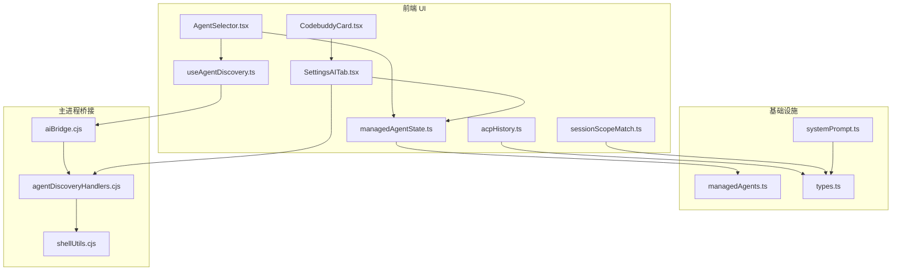

**图表来源**
- [AgentSelector.tsx:118-171](file://components/ai/AgentSelector.tsx#L118-L171)
- [useAgentDiscovery.ts:19-37](file://application/state/useAgentDiscovery.ts#L19-L37)
- [managedAgentState.ts:29-68](file://components/settings/tabs/ai/managedAgentState.ts#L29-L68)
- [managedAgents.ts:1-78](file://infrastructure/ai/managedAgents.ts#L1-L78)
- [types.ts:191-230](file://infrastructure/ai/types.ts#L191-L230)
- [acpHistory.ts:398-428](file://components/ai/acpHistory.ts#L398-L428)
- [aiBridge.cjs:921-958](file://electron/bridges/aiBridge.cjs#L921-L958)
- [agentDiscoveryHandlers.cjs:143-221](file://electron/bridges/aiBridge/agentDiscoveryHandlers.cjs#L143-L221)
- [shellUtils.cjs:267-291](file://electron/bridges/ai/shellUtils.cjs#L267-L291)
- [SettingsAITab.tsx:201-263](file://components/settings/tabs/SettingsAITab.tsx#L201-L263)
- [CodebuddyCard.tsx:16-59](file://components/settings/tabs/ai/CodebuddyCard.tsx#L16-L59)

**章节来源**
- [AgentSelector.tsx:118-171](file://components/ai/AgentSelector.tsx#L118-L171)
- [useAgentDiscovery.ts:19-37](file://application/state/useAgentDiscovery.ts#L19-L37)
- [managedAgentState.ts:29-68](file://components/settings/tabs/ai/managedAgentState.ts#L29-L68)
- [managedAgents.ts:1-78](file://infrastructure/ai/managedAgents.ts#L1-L78)
- [types.ts:191-230](file://infrastructure/ai/types.ts#L191-L230)
- [acpHistory.ts:398-428](file://components/ai/acpHistory.ts#L398-L428)
- [aiBridge.cjs:921-958](file://electron/bridges/aiBridge.cjs#L921-L958)
- [agentDiscoveryHandlers.cjs:143-221](file://electron/bridges/aiBridge/agentDiscoveryHandlers.cjs#L143-L221)
- [shellUtils.cjs:267-291](file://electron/bridges/ai/shellUtils.cjs#L267-L291)
- [SettingsAITab.tsx:201-263](file://components/settings/tabs/SettingsAITab.tsx#L201-L263)
- [CodebuddyCard.tsx:16-59](file://components/settings/tabs/ai/CodebuddyCard.tsx#L16-L59)

## 核心组件
- 代理选择器（AgentSelector）：聚合内置与已启用外部代理，展示可发现但未配置的外部代理并支持一键启用
- 代理发现（useAgentDiscovery）：通过桥接调用执行系统发现，自动同步已配置代理的参数与环境
- **新增** 路径解析器（aiResolveCli）：支持自定义路径解析、平台特定路径处理和版本检测
- 托管代理匹配（managedAgents）：基于命令基名与 ACP 元信息识别受支持的内置托管代理
- 类型与配置（types）：统一定义外部代理配置、发现结果、会话作用域、权限模式与模型预设
- 历史压缩（acpHistory）：构建紧凑上下文与最近原始消息，用于 ACP 回放与兼容性提示
- 主进程桥接（aiBridge）：注册 IPC 处理函数，负责代理生命周期与调试日志

**章节来源**
- [AgentSelector.tsx:118-171](file://components/ai/AgentSelector.tsx#L118-L171)
- [useAgentDiscovery.ts:19-37](file://application/state/useAgentDiscovery.ts#L19-L37)
- [agentDiscoveryHandlers.cjs:143-221](file://electron/bridges/aiBridge/agentDiscoveryHandlers.cjs#L143-L221)
- [managedAgents.ts:1-78](file://infrastructure/ai/managedAgents.ts#L1-L78)
- [types.ts:191-230](file://infrastructure/ai/types.ts#L191-L230)
- [acpHistory.ts:398-428](file://components/ai/acpHistory.ts#L398-L428)
- [aiBridge.cjs:921-958](file://electron/bridges/aiBridge.cjs#L921-L958)

## 架构总览
下图展示从 UI 到主进程的代理发现与启用流程，以及主进程对代理进程的生命周期管理，包括新增的路径解析功能。

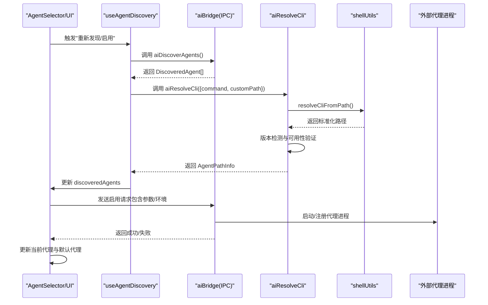

**图表来源**
- [AgentSelector.tsx:181-190](file://components/ai/AgentSelector.tsx#L181-L190)
- [useAgentDiscovery.ts:19-37](file://application/state/useAgentDiscovery.ts#L19-L37)
- [agentDiscoveryHandlers.cjs:143-221](file://electron/bridges/aiBridge/agentDiscoveryHandlers.cjs#L143-L221)
- [shellUtils.cjs:267-291](file://electron/bridges/ai/shellUtils.cjs#L267-L291)

## 详细组件分析

### 代理选择器与启用流程
- 识别与分组：内置代理与已启用外部代理分别展示；未配置的"可发现外部代理"单独分组并提供一键启用
- 启用逻辑：将 DiscoveredAgent 转换为 ExternalAgentConfig 并写入设置，同时自动选中该代理
- 可发现代理过滤：排除已在设置中配置的代理，避免重复

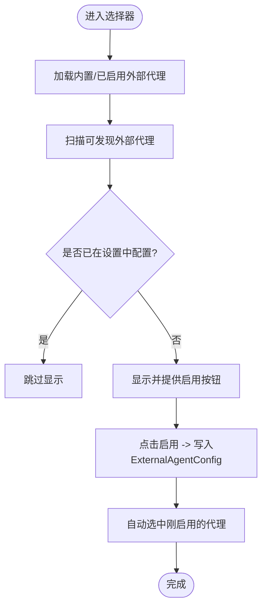

**图表来源**
- [AgentSelector.tsx:131-161](file://components/ai/AgentSelector.tsx#L131-L161)
- [AgentSelector.tsx:181-190](file://components/ai/AgentSelector.tsx#L181-L190)

**章节来源**
- [AgentSelector.tsx:118-171](file://components/ai/AgentSelector.tsx#L118-L171)
- [AgentSelector.tsx:181-190](file://components/ai/AgentSelector.tsx#L181-L190)

### 代理发现与注册
- 发现入口：useAgentDiscovery 通过 window.netcatty.aiDiscoverAgents() 调用主进程
- **更新** 路径解析：新增 aiResolveCli 处理器，支持自定义路径解析和版本检测
- 自动更新：当发现结果中的参数或 ACP 配置变更时，自动同步到已配置代理
- 注册与启用：将 DiscoveredAgent 转换为 ExternalAgentConfig 并写入设置，必要时注入环境变量（如 Claude 的代码执行路径）

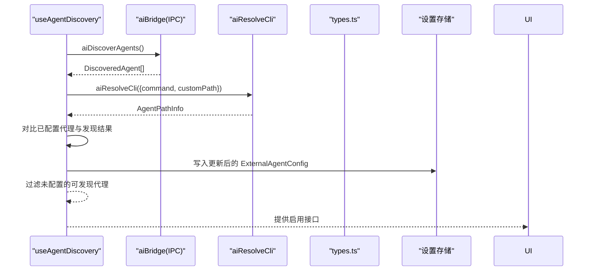

**图表来源**
- [useAgentDiscovery.ts:19-37](file://application/state/useAgentDiscovery.ts#L19-L37)
- [useAgentDiscovery.ts:42-73](file://application/state/useAgentDiscovery.ts#L42-L73)
- [agentDiscoveryHandlers.cjs:143-221](file://electron/bridges/aiBridge/agentDiscoveryHandlers.cjs#L143-L221)
- [types.ts:217-230](file://infrastructure/ai/types.ts#L217-L230)

**章节来源**
- [useAgentDiscovery.ts:19-37](file://application/state/useAgentDiscovery.ts#L19-L37)
- [useAgentDiscovery.ts:42-73](file://application/state/useAgentDiscovery.ts#L42-L73)
- [agentDiscoveryHandlers.cjs:143-221](file://electron/bridges/aiBridge/agentDiscoveryHandlers.cjs#L143-L221)
- [types.ts:217-230](file://infrastructure/ai/types.ts#L217-L230)

### 托管代理匹配算法
- 支持的托管代理键：codex、claude、copilot、codebuddy
- 匹配规则：
  - Claude：严格区分适配器与 CLI 命令，避免将通用 ACP 命令误判为匹配
  - 其他：优先匹配 ACP 命令与主 CLI 命令基名，支持带前缀的变体
- 存储路径解析：优先使用"已发现托管代理"且命令为路径形式的条目，否则回退到其他匹配项

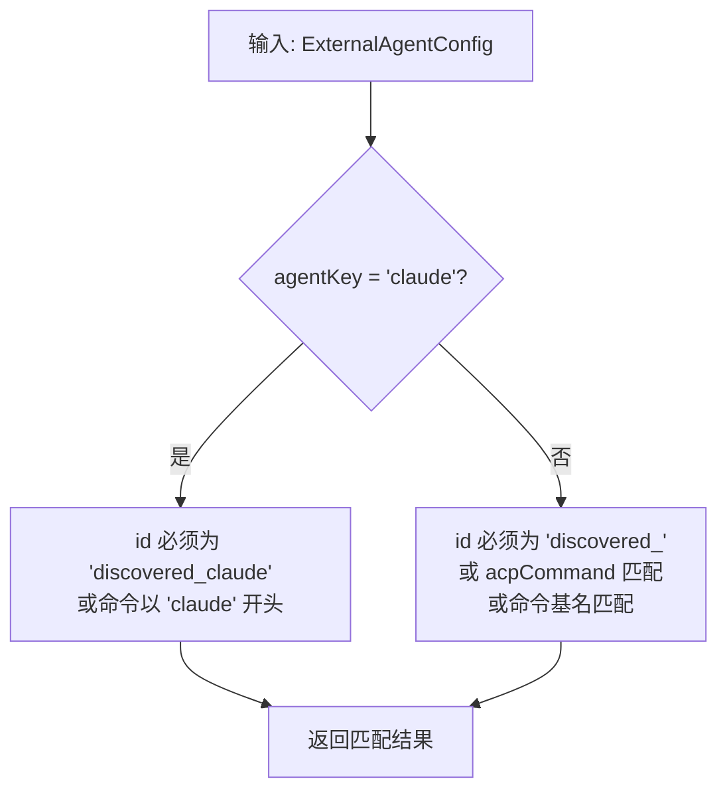

**图表来源**
- [managedAgents.ts:35-53](file://infrastructure/ai/managedAgents.ts#L35-L53)

**章节来源**
- [managedAgents.ts:1-78](file://infrastructure/ai/managedAgents.ts#L1-L78)

### 代理历史管理与上下文压缩
- 历史窗口：最近若干条原始消息，用于保留工具输出等关键字节
- 紧凑上下文：按用户请求与助手上下文优先级抽取，避免重复与冗余
- 版本兼容提示：在紧凑上下文中显式声明"外部 ACP 已有持久化会话上下文"，作为回放时的降级参考
- 扫描边界：限定扫描轮次而非消息总数，保证大转录本场景下的性能

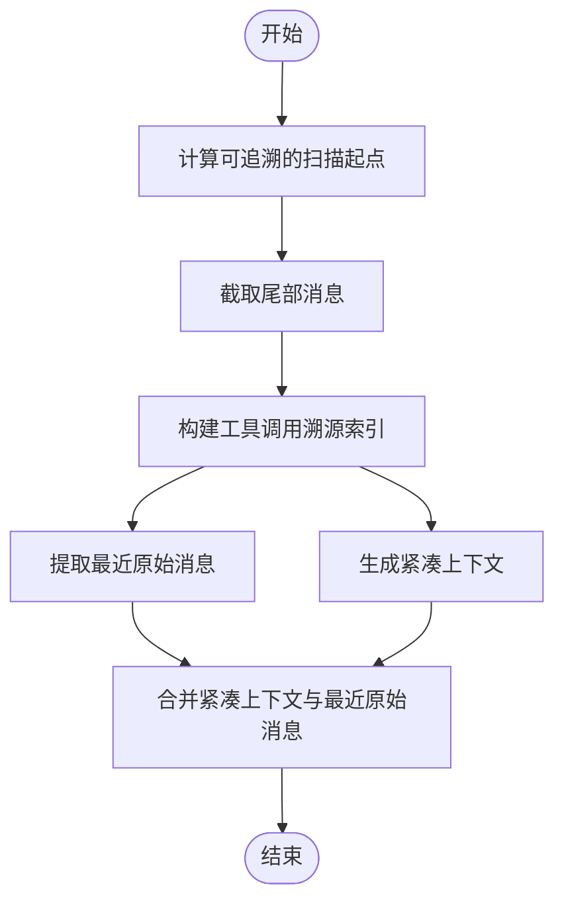

**图表来源**
- [acpHistory.ts:398-428](file://components/ai/acpHistory.ts#L398-L428)

**章节来源**
- [acpHistory.ts:398-428](file://components/ai/acpHistory.ts#L398-L428)

### 代理作用域匹配与权限控制
- 作用域类型：terminal、workspace、global
- 匹配评分：
  - 目标一致：2 分
  - 终端作用域且主机集合交集非空：1 分
  - 其他：0 分
- 活跃会话规避：若会话已在当前终端范围内显示，则不计入可用候选

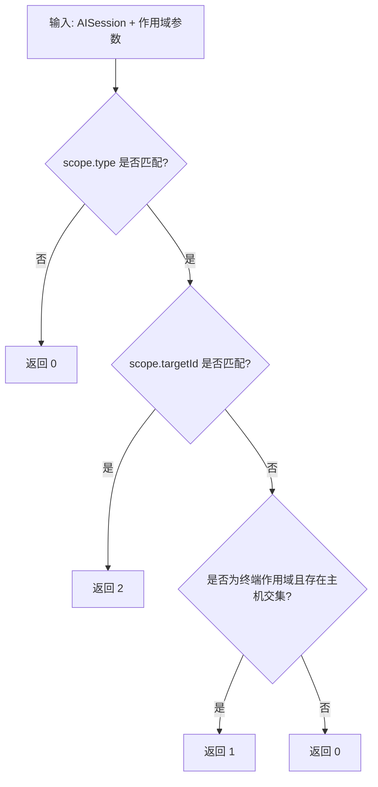

**图表来源**
- [sessionScopeMatch.ts:3-28](file://components/ai/sessionScopeMatch.ts#L3-L28)

**章节来源**
- [sessionScopeMatch.ts:3-28](file://components/ai/sessionScopeMatch.ts#L3-L28)

### 代理配置管理与模型预设
- 默认配置：针对不同托管代理提供默认命令、参数、图标与 ACP 命令
- 环境注入：例如 Claude 在启用时注入代码执行路径环境变量
- 模型预设：根据代理命令基名返回对应预设列表（如 Claude/Codex），用于快速选择思考层级或模型

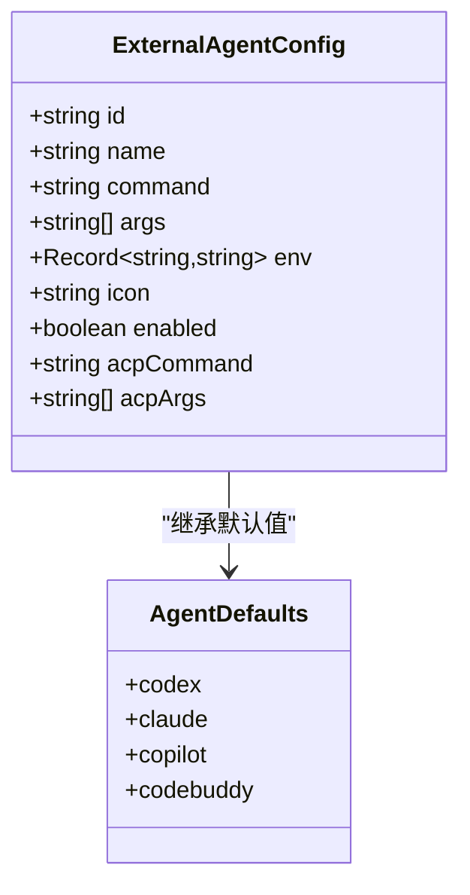

**图表来源**
- [types.ts:204-215](file://infrastructure/ai/types.ts#L204-L215)
- [types.ts:111-140](file://components/settings/tabs/ai/types.ts#L111-L140)

**章节来源**
- [types.ts:204-215](file://infrastructure/ai/types.ts#L204-L215)
- [types.ts:111-140](file://components/settings/tabs/ai/types.ts#L111-L140)

### 主进程代理生命周期与调试
- IPC 注册：注册代理发现、进程管理、ACP 处理等处理器
- 杀进程：支持优雅终止与超时强制回收
- 调试日志：统一前缀与安全序列化输出，便于问题定位

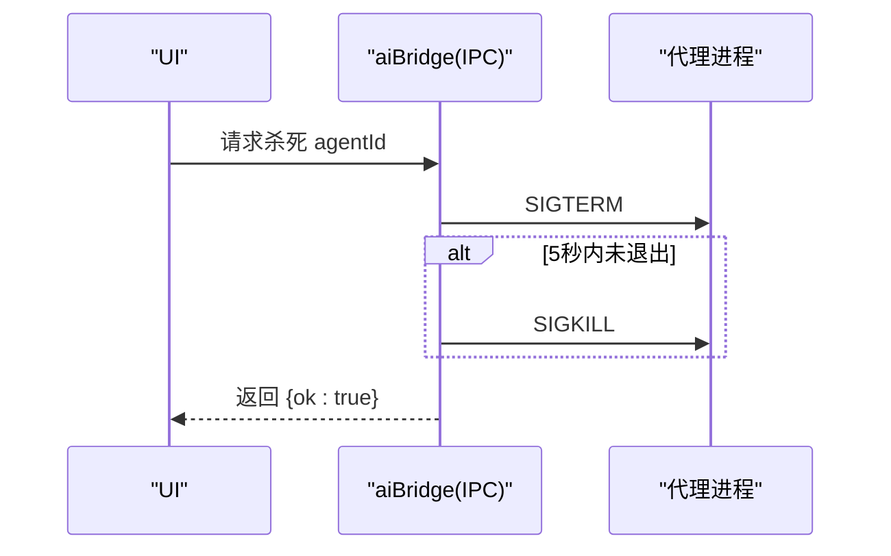

**图表来源**
- [aiBridge.cjs:931-957](file://electron/bridges/aiBridge.cjs#L931-L957)

**章节来源**
- [aiBridge.cjs:921-958](file://electron/bridges/aiBridge.cjs#L921-L958)

## 路径解析功能

### 路径解析器架构
新增的路径解析功能通过 aiResolveCli 处理器实现，支持自定义路径解析、平台特定路径处理和版本检测：

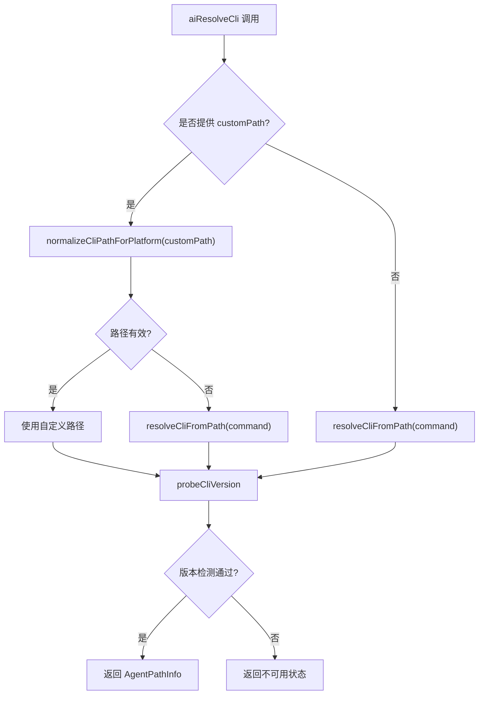

**图表来源**
- [agentDiscoveryHandlers.cjs:143-221](file://electron/bridges/aiBridge/agentDiscoveryHandlers.cjs#L143-L221)
- [shellUtils.cjs:162-189](file://electron/bridges/ai/shellUtils.cjs#L162-L189)
- [shellUtils.cjs:267-291](file://electron/bridges/ai/shellUtils.cjs#L267-L291)

### 平台特定路径处理
- Windows 平台：优先处理 .cmd、.bat、.exe 扩展名，支持 npm 全局安装的可执行文件
- Unix-like 平台：验证文件存在性和可执行权限
- 路径标准化：统一处理路径分隔符和大小写敏感性

### 版本检测与验证
- 支持 --version 参数检测
- 验证版本输出的有效性
- 处理捆绑的 ACP 二进制文件回退机制
- Claude Code 特殊处理：自动解析 npm 包中的 cli.js 文件

### 前端路径解析界面
SettingsAITab.tsx 中实现了完整的路径解析界面，支持：
- 实时路径检测和验证
- 自定义路径输入和验证
- 并发解析多个代理的路径
- 状态管理和错误处理

**章节来源**
- [agentDiscoveryHandlers.cjs:143-221](file://electron/bridges/aiBridge/agentDiscoveryHandlers.cjs#L143-L221)
- [shellUtils.cjs:162-189](file://electron/bridges/ai/shellUtils.cjs#L162-L189)
- [shellUtils.cjs:267-291](file://electron/bridges/ai/shellUtils.cjs#L267-L291)
- [SettingsAITab.tsx:201-263](file://components/settings/tabs/SettingsAITab.tsx#L201-L263)
- [CodebuddyCard.tsx:16-59](file://components/settings/tabs/ai/CodebuddyCard.tsx#L16-L59)

## 依赖关系分析
- UI 依赖应用状态钩子进行发现与启用
- 应用状态依赖主进程桥接进行系统发现
- **新增** 路径解析依赖 shellUtils 提供的路径处理工具
- 托管代理匹配依赖类型定义中的命令基名与 ACP 元信息
- 历史压缩依赖聊天消息结构与工具调用溯源
- 系统提示依赖作用域、主机与权限模式

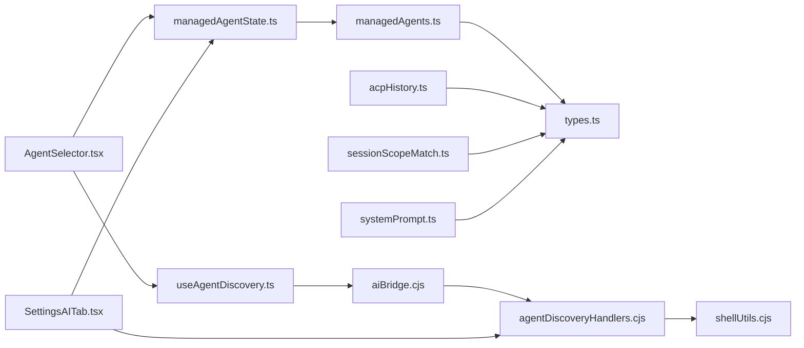

**图表来源**
- [AgentSelector.tsx:118-171](file://components/ai/AgentSelector.tsx#L118-L171)
- [useAgentDiscovery.ts:19-37](file://application/state/useAgentDiscovery.ts#L19-L37)
- [managedAgentState.ts:29-68](file://components/settings/tabs/ai/managedAgentState.ts#L29-L68)
- [managedAgents.ts:1-78](file://infrastructure/ai/managedAgents.ts#L1-L78)
- [types.ts:191-230](file://infrastructure/ai/types.ts#L191-L230)
- [acpHistory.ts:398-428](file://components/ai/acpHistory.ts#L398-L428)
- [sessionScopeMatch.ts:3-28](file://components/ai/sessionScopeMatch.ts#L3-L28)
- [systemPrompt.ts:20-43](file://infrastructure/ai/cattyAgent/systemPrompt.ts#L20-L43)
- [agentDiscoveryHandlers.cjs:143-221](file://electron/bridges/aiBridge/agentDiscoveryHandlers.cjs#L143-L221)
- [shellUtils.cjs:267-291](file://electron/bridges/ai/shellUtils.cjs#L267-L291)
- [SettingsAITab.tsx:201-263](file://components/settings/tabs/SettingsAITab.tsx#L201-L263)

**章节来源**
- [AgentSelector.tsx:118-171](file://components/ai/AgentSelector.tsx#L118-L171)
- [useAgentDiscovery.ts:19-37](file://application/state/useAgentDiscovery.ts#L19-L37)
- [managedAgentState.ts:29-68](file://components/settings/tabs/ai/managedAgentState.ts#L29-L68)
- [managedAgents.ts:1-78](file://infrastructure/ai/managedAgents.ts#L1-L78)
- [types.ts:191-230](file://infrastructure/ai/types.ts#L191-L230)
- [acpHistory.ts:398-428](file://components/ai/acpHistory.ts#L398-L428)
- [sessionScopeMatch.ts:3-28](file://components/ai/sessionScopeMatch.ts#L3-L28)
- [systemPrompt.ts:20-43](file://infrastructure/ai/cattyAgent/systemPrompt.ts#L20-L43)
- [agentDiscoveryHandlers.cjs:143-221](file://electron/bridges/aiBridge/agentDiscoveryHandlers.cjs#L143-L221)
- [shellUtils.cjs:267-291](file://electron/bridges/ai/shellUtils.cjs#L267-L291)
- [SettingsAITab.tsx:201-263](file://components/settings/tabs/SettingsAITab.tsx#L201-L263)

## 性能考量
- 历史压缩扫描边界：限制扫描轮次而非消息数，避免大转录本场景下的线性遍历开销
- 原始消息窗口：固定数量与字符上限，减少重复与冗余
- 紧凑上下文去重：基于规范化后的内容集合去重，控制字符总量
- 作用域匹配：仅在终端作用域下进行主机集合交集判断，降低无关比较成本
- **新增** 路径解析缓存：shell 环境缓存和路径解析结果缓存，减少重复系统调用
- 并发解析：支持多个代理路径的并发解析，提高设置界面响应速度

## 故障排查指南
- 代理不可见或不可用
  - 检查主进程发现处理器是否注册成功
  - 校验代理二进制可执行性与版本输出是否符合预期
  - **新增** 使用 aiResolveCli 接口手动验证路径解析
  - 参考测试用例中的失败场景（不可运行、加载器错误）
- 启用后无法发送
  - 确认代理处于启用状态
  - 核对代理命令与参数是否与发现结果一致
  - **新增** 检查路径解析结果和版本检测状态
- 历史回放异常
  - 关注紧凑上下文中的兼容性提示，确认外部 ACP 是否具备持久化上下文
  - 检查工具调用溯源索引是否正确构建
- 权限与作用域
  - 若会话已在当前终端范围显示，不会被再次匹配为可用候选
  - 确认权限模式与工具集成模式配置满足任务需求
- **新增** 路径解析问题
  - 检查自定义路径格式和权限
  - 验证平台特定路径处理（Windows 扩展名、Unix 可执行权限）
  - 确认 shell 环境变量和 PATH 设置正确

**章节来源**
- [aiBridge.test.cjs:398-487](file://electron/bridges/aiBridge.test.cjs#L398-L487)
- [agentSendEligibility.ts:10-15](file://components/ai/agentSendEligibility.ts#L10-L15)
- [acpHistory.ts:355-378](file://components/ai/acpHistory.ts#L355-L378)
- [sessionScopeMatch.ts:23-25](file://components/ai/sessionScopeMatch.ts#L23-L25)
- [agentDiscoveryHandlers.cjs:143-221](file://electron/bridges/aiBridge/agentDiscoveryHandlers.cjs#L143-L221)

## 结论
本系统通过"UI 选择器 + 应用状态 + 基础设施 + 主进程桥接"的分层设计，实现了对内置与外部代理的全生命周期管理。其关键特性包括：
- 自动发现与智能匹配，降低用户配置成本
- **新增** 完善的路径解析功能，改进对 codebuddy 等代理的路径处理能力
- 历史压缩与上下文提示，提升跨会话一致性
- 作用域与权限控制，保障终端与工作区场景的安全与可控
- 完整的 IPC 生命周期管理与调试日志，便于运维与排障

## 附录
- 最佳实践建议
  - 代理选择策略：优先启用系统发现的托管代理，结合模型预设与参数微调
  - **新增** 路径解析策略：优先使用系统 PATH，必要时提供自定义路径
  - 性能监控：关注历史压缩扫描边界与字符上限，避免超大转录本导致的内存压力
  - 故障诊断：利用统一调试前缀与测试用例覆盖的失败场景进行对照排查
  - 运维建议：定期清理不可用代理、校验 ACP 命令与参数、确保权限模式与工具集成模式与业务目标一致
  - **新增** 路径解析维护：定期验证代理路径有效性，检查平台特定路径处理