# 认证方式

<cite>
**本文引用的文件**
- [domain/sshAuth.ts](file://domain/sshAuth.ts)
- [domain/credentials.ts](file://domain/credentials.ts)
- [electron/bridges/sshAuthHelper.cjs](file://electron/bridges/sshAuthHelper.cjs)
- [electron/bridges/privateKeyNormalizer.cjs](file://electron/bridges/privateKeyNormalizer.cjs)
- [electron/bridges/privateKeyNormalizer.test.cjs](file://electron/bridges/privateKeyNormalizer.test.cjs)
- [electron/bridges/sshAuthHelper.pkcs8.test.cjs](file://electron/bridges/sshAuthHelper.pkcs8.test.cjs)
- [electron/bridges/passphraseHandler.cjs](file://electron/bridges/passphraseHandler.cjs)
- [electron/bridges/keyboardInteractiveHandler.cjs](file://electron/bridges/keyboardInteractiveHandler.cjs)
- [components/keychain/GenerateStandardPanel.tsx](file://components/keychain/GenerateStandardPanel.tsx)
- [components/keychain/ImportKeyPanel.tsx](file://components/keychain/ImportKeyPanel.tsx)
- [components/keychain/IdentityPanel.tsx](file://components/keychain/IdentityPanel.tsx)
- [components/terminal/TerminalAuthDialog.tsx](file://components/terminal/TerminalAuthDialog.tsx)
- [components/KeyboardInteractiveModal.tsx](file://components/KeyboardInteractiveModal.tsx)
- [components/PassphraseModal.tsx](file://components/PassphraseModal.tsx)
- [components/keychain/utils.ts](file://components/keychain/utils.ts)
- [application/state/useVaultState.ts](file://application/state/useVaultState.ts)
- [application/defaultKeyPassphrases.ts](file://application/defaultKeyPassphrases.ts)
</cite>

## 更新摘要
**所做更改**
- 新增PKCS#8私钥支持系统的详细说明
- 更新密钥规范化流程和认证处理机制
- 添加PKCS#8私钥转换和验证的新章节
- 更新密钥生成和导入功能以支持PKCS#8格式
- 增强认证流程以包含新的私钥规范化系统

## 目录
1. [简介](#简介)
2. [项目结构与角色分工](#项目结构与角色分工)
3. [核心组件总览](#核心组件总览)
4. [架构概览](#架构概览)
5. [详细组件解析](#详细组件解析)
6. [PKCS#8私钥支持系统](#pkcs8私钥支持系统)
7. [依赖关系分析](#依赖关系分析)
8. [性能与安全性考量](#性能与安全性考量)
9. [故障排查指南](#故障排查指南)
10. [结论](#结论)

## 简介
本章节面向"SSH认证方式"功能，系统阐述以下内容：
- 多种认证方式：密码认证、公钥认证、证书认证、键盘交互认证（含MFA/OTP场景）。
- SSH密钥全生命周期：生成、导入、保存、管理、使用与私钥保护（Passphrase）。
- 凭据管理：加密存储、自动填充、安全保护策略。
- 身份管理：多身份配置、继承关系、默认身份设置。
- **新增**：PKCS#8私钥支持系统，包括私钥规范化、格式转换和兼容性处理。
- 安全性对比与最佳实践，以及常见问题排查。

## 项目结构与角色分工
- 域模型与解析层（domain）：定义主机、身份、密钥等模型，负责认证方式推断与凭据净化。
- **新增**：私钥规范化层（electron/bridges/privateKeyNormalizer.cjs）：专门处理PKCS#8私钥格式转换和兼容性问题。
- 桥接层（electron/bridges）：在主进程实现SSH握手、密钥加载、Passphrase与键盘交互对话框的IPC桥接。
- 组件层（components）：提供UI面板与对话框，支持密钥生成/导入、身份编辑、终端认证弹窗、键盘交互与Passphrase输入。
- 应用状态层（application）：密钥与凭据的本地持久化、加密与同步控制。

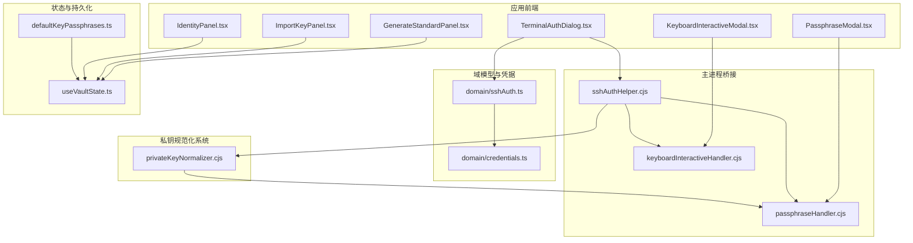

**图表来源**
- [domain/sshAuth.ts:1-125](file://domain/sshAuth.ts#L1-L125)
- [domain/credentials.ts:1-111](file://domain/credentials.ts#L1-L111)
- [electron/bridges/sshAuthHelper.cjs:1-981](file://electron/bridges/sshAuthHelper.cjs#L1-L981)
- [electron/bridges/privateKeyNormalizer.cjs:1-104](file://electron/bridges/privateKeyNormalizer.cjs#L1-L104)
- [electron/bridges/passphraseHandler.cjs:1-191](file://electron/bridges/passphraseHandler.cjs#L1-L191)
- [electron/bridges/keyboardInteractiveHandler.cjs:1-107](file://electron/bridges/keyboardInteractiveHandler.cjs#L1-L107)
- [components/terminal/TerminalAuthDialog.tsx:1-307](file://components/terminal/TerminalAuthDialog.tsx#L1-L307)
- [components/KeyboardInteractiveModal.tsx:1-228](file://components/KeyboardInteractiveModal.tsx#L1-L228)
- [components/PassphraseModal.tsx:1-184](file://components/PassphraseModal.tsx#L1-L184)
- [application/state/useVaultState.ts:156-199](file://application/state/useVaultState.ts#L156-L199)
- [application/defaultKeyPassphrases.ts:73-93](file://application/defaultKeyPassphrases.ts#L73-L93)

**章节来源**
- [domain/sshAuth.ts:1-125](file://domain/sshAuth.ts#L1-L125)
- [domain/credentials.ts:1-111](file://domain/credentials.ts#L1-L111)
- [electron/bridges/sshAuthHelper.cjs:1-981](file://electron/bridges/sshAuthHelper.cjs#L1-L981)
- [electron/bridges/privateKeyNormalizer.cjs:1-104](file://electron/bridges/privateKeyNormalizer.cjs#L1-L104)
- [electron/bridges/passphraseHandler.cjs:1-191](file://electron/bridges/passphraseHandler.cjs#L1-L191)
- [electron/bridges/keyboardInteractiveHandler.cjs:1-107](file://electron/bridges/keyboardInteractiveHandler.cjs#L1-L107)
- [components/terminal/TerminalAuthDialog.tsx:1-307](file://components/terminal/TerminalAuthDialog.tsx#L1-L307)
- [components/KeyboardInteractiveModal.tsx:1-228](file://components/KeyboardInteractiveModal.tsx#L1-L228)
- [components/PassphraseModal.tsx:1-184](file://components/PassphraseModal.tsx#L1-L184)
- [application/state/useVaultState.ts:156-199](file://application/state/useVaultState.ts#L156-L199)
- [application/defaultKeyPassphrases.ts:73-93](file://application/defaultKeyPassphrases.ts#L73-L93)

## 核心组件总览
- 认证方式推断与解析：根据主机、身份、覆盖参数与密钥状态，确定最终使用的认证方式（密码/公钥/证书）。
- **增强**：PKCS#8私钥规范化：自动检测和转换PKCS#8格式的私钥，确保与ssh2库的兼容性。
- 主进程认证处理器：构建动态认证序列，支持系统ssh-agent、用户配置密钥、默认密钥回退、键盘交互与密码认证。
- 凭据安全：识别并屏蔽设备绑定的加密占位符，避免明文泄露；提供凭据路径扫描以阻止错误数据上行。
- UI与对话框：终端认证弹窗、键盘交互对话框、Passphrase输入框，支持一键自动填充与安全显示。
- 密钥与身份管理：生成标准密钥、导入现有密钥、编辑身份、导出公钥到远端主机、默认密钥Passphrase记忆。

**章节来源**
- [domain/sshAuth.ts:44-103](file://domain/sshAuth.ts#L44-L103)
- [electron/bridges/sshAuthHelper.cjs:464-718](file://electron/bridges/sshAuthHelper.cjs#L464-L718)
- [electron/bridges/privateKeyNormalizer.cjs:43-97](file://electron/bridges/privateKeyNormalizer.cjs#L43-L97)
- [domain/credentials.ts:30-110](file://domain/credentials.ts#L30-L110)
- [components/terminal/TerminalAuthDialog.tsx:18-39](file://components/terminal/TerminalAuthDialog.tsx#L18-L39)
- [components/KeyboardInteractiveModal.tsx:25-48](file://components/KeyboardInteractiveModal.tsx#L25-L48)
- [components/PassphraseModal.tsx:26-31](file://components/PassphraseModal.tsx#L26-L31)

## 架构概览
下图展示从用户选择认证方式到主进程执行SSH握手的关键流程，包括密钥加载、Passphrase请求、键盘交互与回退策略，以及新增的PKCS#8私钥规范化处理。

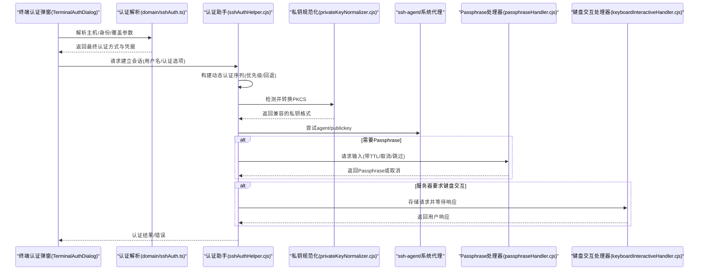

**图表来源**
- [domain/sshAuth.ts:44-103](file://domain/sshAuth.ts#L44-L103)
- [electron/bridges/sshAuthHelper.cjs:464-718](file://electron/bridges/sshAuthHelper.cjs#L464-L718)
- [electron/bridges/privateKeyNormalizer.cjs:43-97](file://electron/bridges/privateKeyNormalizer.cjs#L43-L97)
- [electron/bridges/passphraseHandler.cjs:76-139](file://electron/bridges/passphraseHandler.cjs#L76-L139)
- [electron/bridges/keyboardInteractiveHandler.cjs:26-49](file://electron/bridges/keyboardInteractiveHandler.cjs#L26-L49)

## 详细组件解析

### 认证方式推断与凭据解析
- 支持的认证方式：密码、公钥、证书。
- 推断规则：
  - 显式覆盖优先；
  - 若指定密钥ID，则依据密钥是否为证书决定"证书"或"公钥"；
  - 否则按主机/身份配置推断；
  - 若存在密码则走密码认证；
  - 默认回退到密码认证。
- 凭据净化：屏蔽设备绑定的加密占位符，确保不会把占位符作为真实密码发送至服务器。

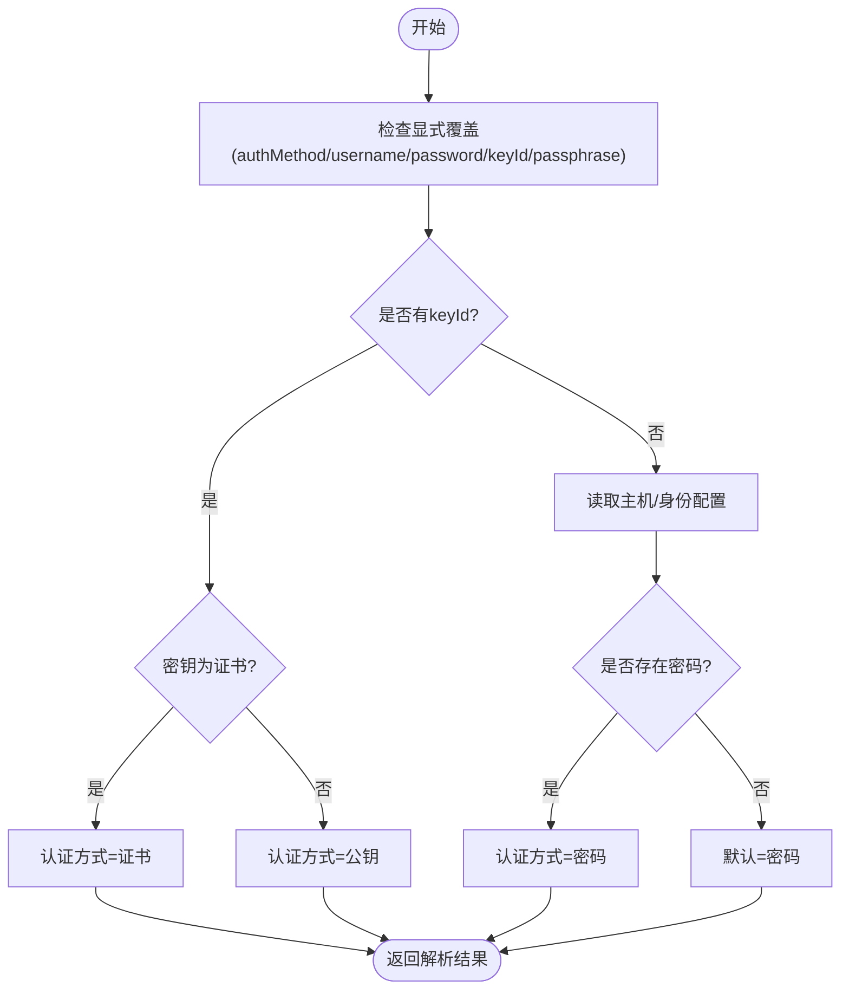

**图表来源**
- [domain/sshAuth.ts:25-42](file://domain/sshAuth.ts#L25-L42)
- [domain/sshAuth.ts:44-103](file://domain/sshAuth.ts#L44-L103)

**章节来源**
- [domain/sshAuth.ts:44-103](file://domain/sshAuth.ts#L44-L103)
- [domain/credentials.ts:30-52](file://domain/credentials.ts#L30-L52)

### 主进程认证处理器与回退策略
- 动态认证序列：
  - 首先尝试"无凭据"探测（RFC 4252），用于发现可用方法与支持密码登录的设备；
  - 用户显式配置优先：agent、用户密钥、密码；
  - 默认密钥回退：当未显式配置时，尝试系统默认密钥集合；
  - 键盘交互最后兜底。
- **增强**：PKCS#8私钥规范化集成：在密钥解析前自动检测和转换PKCS#8格式。
- 系统ssh-agent集成：跨平台检测socket/管道可用性，支持Bitwarden、1Password等第三方代理。
- 密钥加载与校验：支持从文件路径加载、解析OpenSSH/PuTTY等格式，识别加密状态并触发Passphrase流程。

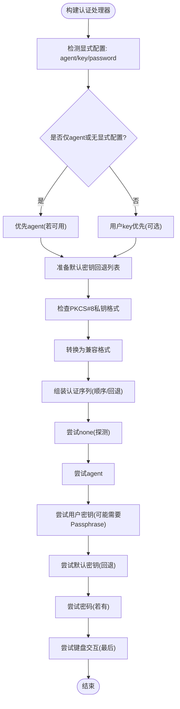

**图表来源**
- [electron/bridges/sshAuthHelper.cjs:464-718](file://electron/bridges/sshAuthHelper.cjs#L464-L718)
- [electron/bridges/sshAuthHelper.cjs:296-373](file://electron/bridges/sshAuthHelper.cjs#L296-L373)
- [electron/bridges/privateKeyNormalizer.cjs:43-97](file://electron/bridges/privateKeyNormalizer.cjs#L43-L97)

**章节来源**
- [electron/bridges/sshAuthHelper.cjs:464-718](file://electron/bridges/sshAuthHelper.cjs#L464-L718)
- [electron/bridges/sshAuthHelper.cjs:296-373](file://electron/bridges/sshAuthHelper.cjs#L296-L373)
- [electron/bridges/privateKeyNormalizer.cjs:43-97](file://electron/bridges/privateKeyNormalizer.cjs#L43-L97)

### Passphrase输入与安全处理
- 请求与响应：
  - 主进程通过IPC向渲染进程发起Passphrase请求；
  - 渲染进程弹出模态框，支持显示/隐藏、记住Passphrase；
  - 支持取消、跳过（跳过当前密钥但继续其他尝试）与超时清理。
- 安全要点：
  - 输入失败时通知主进程，避免重复尝试；
  - 可将默认密钥的Passphrase记忆到本地状态与持久化存储中。

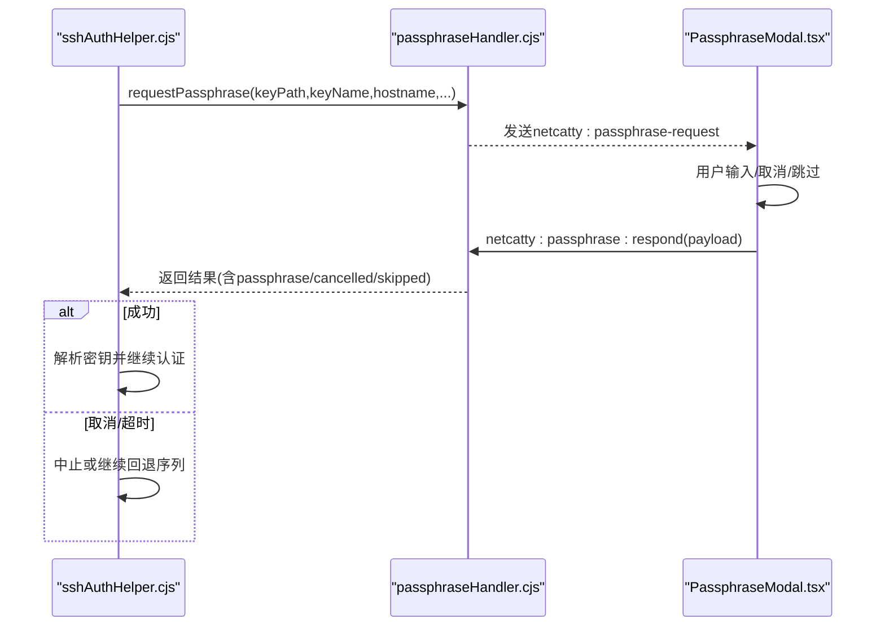

**图表来源**
- [electron/bridges/passphraseHandler.cjs:76-139](file://electron/bridges/passphraseHandler.cjs#L76-L139)
- [components/PassphraseModal.tsx:26-31](file://components/PassphraseModal.tsx#L26-L31)

**章节来源**
- [electron/bridges/passphraseHandler.cjs:76-139](file://electron/bridges/passphraseHandler.cjs#L76-L139)
- [components/PassphraseModal.tsx:26-31](file://components/PassphraseModal.tsx#L26-L31)
- [application/defaultKeyPassphrases.ts:73-93](file://application/defaultKeyPassphrases.ts#L73-L93)

### 键盘交互认证（含MFA/OTP）
- 自动填充策略：单提示、无回显、包含"密码"关键词且不含OTP词汇时，可自动填入已保存密码，避免误触锁屏。
- 对话框体验：逐项显示提示，支持显示/隐藏密码输入，首项自动聚焦；可选择保存本次密码。
- 超时与取消：请求带TTL，超时自动清理并终止；用户可随时取消。

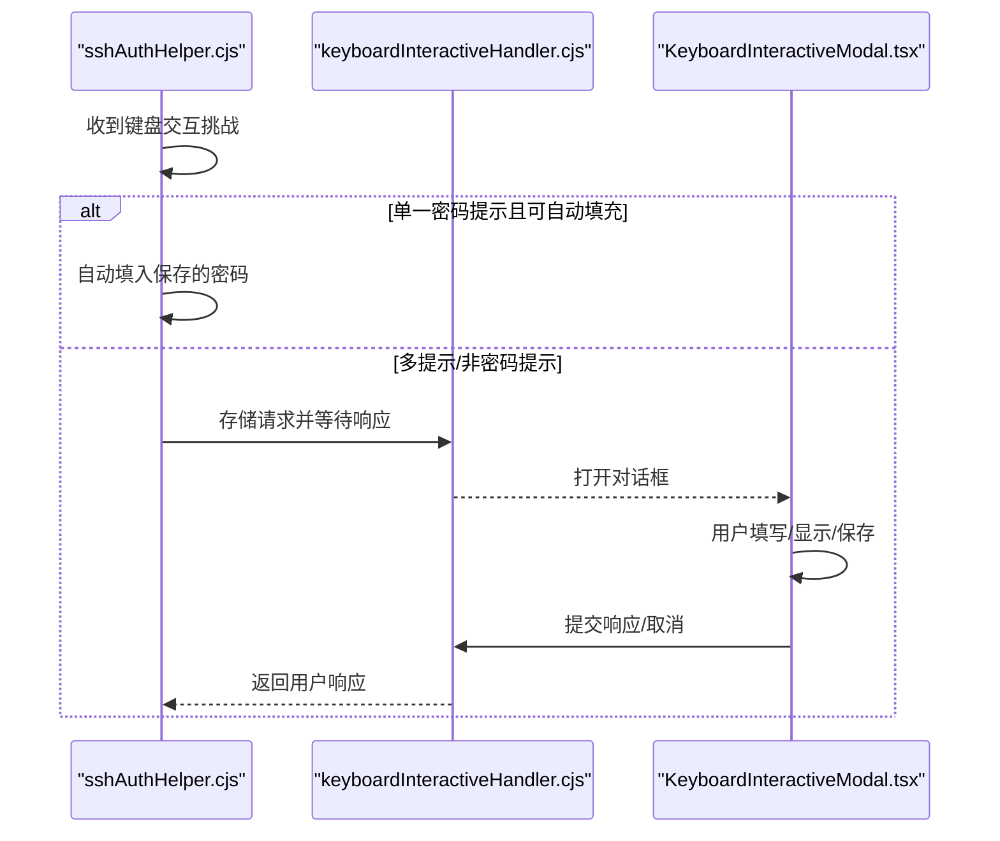

**图表来源**
- [electron/bridges/sshAuthHelper.cjs:782-790](file://electron/bridges/sshAuthHelper.cjs#L782-L790)
- [electron/bridges/sshAuthHelper.cjs:828-861](file://electron/bridges/sshAuthHelper.cjs#L828-L861)
- [electron/bridges/keyboardInteractiveHandler.cjs:26-49](file://electron/bridges/keyboardInteractiveHandler.cjs#L26-L49)

**章节来源**
- [electron/bridges/sshAuthHelper.cjs:782-790](file://electron/bridges/sshAuthHelper.cjs#L782-L790)
- [electron/bridges/sshAuthHelper.cjs:828-861](file://electron/bridges/sshAuthHelper.cjs#L828-L861)
- [components/KeyboardInteractiveModal.tsx:25-48](file://components/KeyboardInteractiveModal.tsx#L25-L48)

### SSH密钥生成、导入与管理
- 生成标准密钥：
  - 支持类型：ED25519、ECDSA、RSA；
  - 可选密钥大小（RSA/ECDSA）；
  - 支持设置Passphrase与是否保存Passphrase。
- **增强**：PKCS#8格式支持：
  - 生成的密钥默认使用PKCS#8格式，提高兼容性；
  - 自动检测和转换现有密钥格式；
  - 支持导入PKCS#8格式的现有密钥。
- 导入现有密钥：
  - 支持拖拽/文件选择；
  - 自动识别密钥类型；
  - 可选导入公钥与证书。
- 身份管理：
  - 为身份绑定用户名与凭据（密码或密钥/证书）；
  - 支持清空已选凭据并切换类型；
  - 在终端认证弹窗中可直接选择身份对应的凭据。

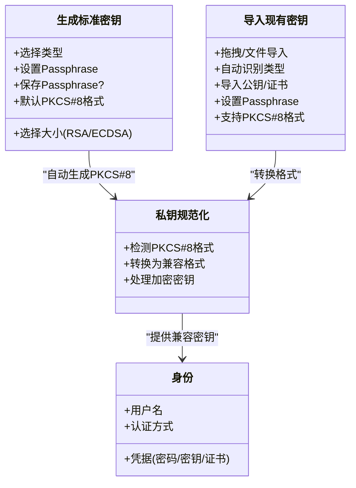

**图表来源**
- [components/keychain/GenerateStandardPanel.tsx:14-30](file://components/keychain/GenerateStandardPanel.tsx#L14-L30)
- [components/keychain/ImportKeyPanel.tsx:15-29](file://components/keychain/ImportKeyPanel.tsx#L15-L29)
- [components/keychain/IdentityPanel.tsx:16-34](file://components/keychain/IdentityPanel.tsx#L16-L34)
- [electron/bridges/privateKeyNormalizer.cjs:43-97](file://electron/bridges/privateKeyNormalizer.cjs#L43-L97)

**章节来源**
- [components/keychain/GenerateStandardPanel.tsx:14-30](file://components/keychain/GenerateStandardPanel.tsx#L14-L30)
- [components/keychain/ImportKeyPanel.tsx:15-29](file://components/keychain/ImportKeyPanel.tsx#L15-L29)
- [components/keychain/IdentityPanel.tsx:16-34](file://components/keychain/IdentityPanel.tsx#L16-L34)
- [components/keychain/utils.ts:29-34](file://components/keychain/utils.ts#L29-L34)
- [electron/bridges/privateKeyNormalizer.cjs:43-97](file://electron/bridges/privateKeyNormalizer.cjs#L43-L97)

### 凭据管理与安全保护
- 加密占位符识别：通过前缀与平台特定头部签名识别设备绑定的加密占位符，避免将其作为明文发送。
- 同步前扫描：遍历同步载荷，定位仍携带占位符的字段，防止推送不可解密数据。
- UI侧净化：在连接边界对单个凭据值进行净化，确保不把占位符传给服务器。

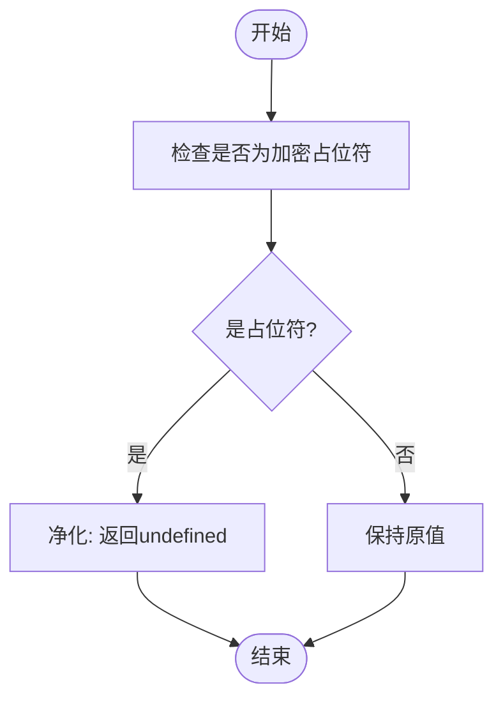

**图表来源**
- [domain/credentials.ts:30-52](file://domain/credentials.ts#L30-L52)

**章节来源**
- [domain/credentials.ts:30-110](file://domain/credentials.ts#L30-L110)

### 终端认证弹窗与凭据选择
- 支持"密码/密钥（含证书）"两种模式切换；
- 密码模式：用户名必填，密码可显示/隐藏；
- 密钥模式：展示所有可选密钥（含证书），自动带入对应Passphrase；
- 提交行为：支持"继续并保存"和"仅继续"。

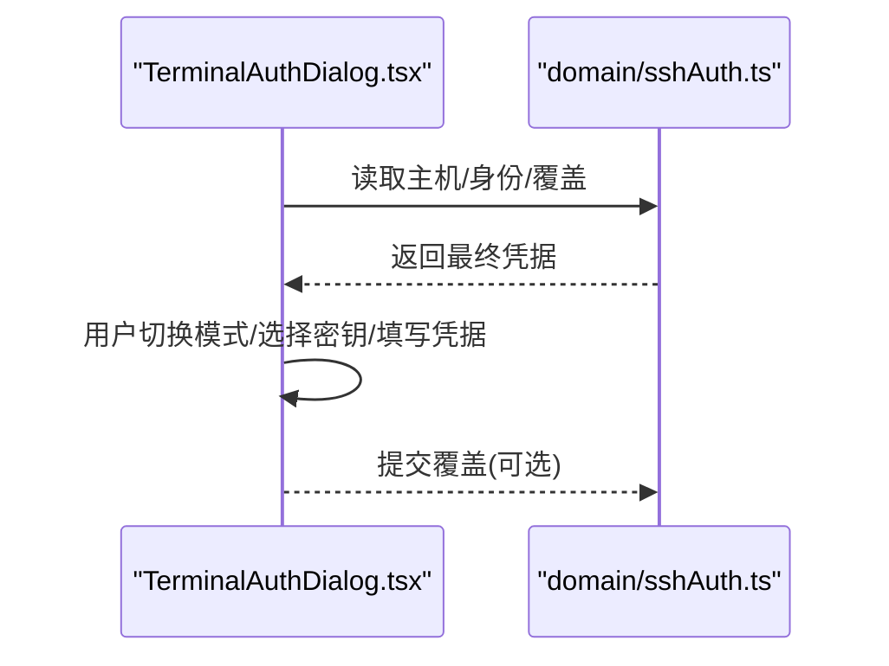

**图表来源**
- [components/terminal/TerminalAuthDialog.tsx:18-39](file://components/terminal/TerminalAuthDialog.tsx#L18-L39)
- [domain/sshAuth.ts:44-103](file://domain/sshAuth.ts#L44-L103)

**章节来源**
- [components/terminal/TerminalAuthDialog.tsx:18-39](file://components/terminal/TerminalAuthDialog.tsx#L18-L39)
- [domain/sshAuth.ts:44-103](file://domain/sshAuth.ts#L44-L103)

## PKCS#8私钥支持系统

### 私钥规范化器概述
新增的PKCS#8私钥支持系统通过专门的规范化器处理现代SSH客户端常用的PKCS#8格式私钥。该系统解决了ssh2库不直接支持PKCS#8格式的问题，提供了透明的格式转换功能。

### 核心功能特性
- **自动格式检测**：识别PKCS#8格式的私钥（包含BEGIN PRIVATE KEY和BEGIN ENCRYPTED PRIVATE KEY头部）
- **智能转换**：将PKCS#8格式转换为ssh2库可接受的传统PEM格式
- **加密密钥处理**：支持解密PKCS#8加密私钥并转换为可解析格式
- **类型兼容性**：支持RSA和EC私钥的PKCS#8到传统格式转换
- **错误处理**：提供明确的错误信息和恢复建议

### 支持的密钥类型转换
- **RSA PKCS#8 → PKCS#1 PEM**：将RSA私钥从PKCS#8格式转换为传统的PKCS#1格式
- **EC PKCS#8 → SEC1 PEM**：将椭圆曲线私钥从PKCS#8格式转换为SEC1格式
- **Ed25519处理**：对于Ed25519等不支持的传统格式的密钥，提供明确的转换建议

### 安全性和兼容性保障
- **透明转换**：对用户完全透明，无需手动转换密钥格式
- **加密密钥安全**：正确处理加密的PKCS#8私钥，确保安全性
- **错误隔离**：提供具体的错误类型和诊断信息
- **向后兼容**：不影响现有OpenSSH和PuTTY密钥的使用

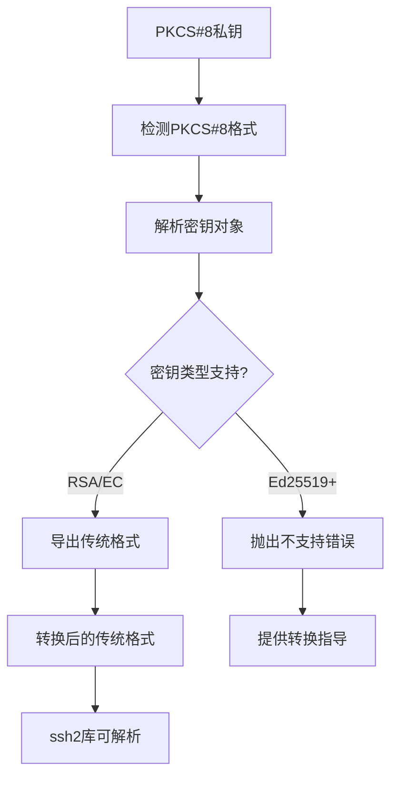

**图表来源**
- [electron/bridges/privateKeyNormalizer.cjs:43-97](file://electron/bridges/privateKeyNormalizer.cjs#L43-L97)
- [electron/bridges/privateKeyNormalizer.test.cjs:41-85](file://electron/bridges/privateKeyNormalizer.test.cjs#L41-L85)

### 认证流程集成
PKCS#8私钥规范化系统无缝集成到现有的认证流程中：

1. **密钥加载阶段**：从文件或内存加载私钥内容
2. **格式检测**：检查是否为PKCS#8格式
3. **自动转换**：如需转换则进行格式转换
4. **加密处理**：处理加密的私钥（如果有的话）
5. **认证执行**：使用转换后的密钥进行SSH认证

### 测试覆盖
系统包含全面的测试用例，验证各种场景：
- 未加密RSA PKCS#8密钥的转换
- 未加密EC PKCS#8密钥的转换  
- 加密PKCS#8密钥的解密和转换
- 错误密码的处理
- 不支持类型的密钥处理
- 非PKCS#8内容的透明传递

**章节来源**
- [electron/bridges/privateKeyNormalizer.cjs:1-104](file://electron/bridges/privateKeyNormalizer.cjs#L1-L104)
- [electron/bridges/privateKeyNormalizer.test.cjs:1-92](file://electron/bridges/privateKeyNormalizer.test.cjs#L1-L92)
- [electron/bridges/sshAuthHelper.pkcs8.test.cjs:1-87](file://electron/bridges/sshAuthHelper.pkcs8.test.cjs#L1-L87)
- [electron/bridges/sshAuthHelper.cjs:140-162](file://electron/bridges/sshAuthHelper.cjs#L140-L162)

## 依赖关系分析
- 组件耦合：
  - 终端认证弹窗依赖域解析与主进程认证助手；
  - **新增**：主进程认证助手依赖私钥规范化器进行PKCS#8格式处理；
  - 键盘交互与Passphrase对话框依赖各自的IPC处理器；
  - 密钥与身份面板依赖状态层进行持久化与加密。
- 外部依赖：
  - ssh2库用于密钥解析与握手；
  - **新增**：Node.js crypto模块用于PKCS#8密钥的解析和转换；
  - 平台ssh-agent socket/管道用于代理认证；
  - 本地存储与加密服务用于凭据持久化。

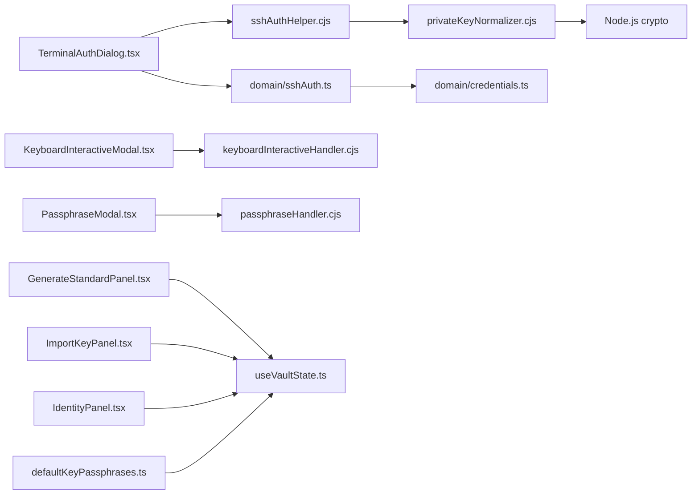

**图表来源**
- [domain/sshAuth.ts:1-125](file://domain/sshAuth.ts#L1-L125)
- [domain/credentials.ts:1-111](file://domain/credentials.ts#L1-L111)
- [electron/bridges/sshAuthHelper.cjs:1-981](file://electron/bridges/sshAuthHelper.cjs#L1-L981)
- [electron/bridges/privateKeyNormalizer.cjs:1-104](file://electron/bridges/privateKeyNormalizer.cjs#L1-L104)
- [electron/bridges/passphraseHandler.cjs:1-191](file://electron/bridges/passphraseHandler.cjs#L1-L191)
- [electron/bridges/keyboardInteractiveHandler.cjs:1-107](file://electron/bridges/keyboardInteractiveHandler.cjs#L1-L107)
- [components/terminal/TerminalAuthDialog.tsx:1-307](file://components/terminal/TerminalAuthDialog.tsx#L1-L307)
- [components/KeyboardInteractiveModal.tsx:1-228](file://components/KeyboardInteractiveModal.tsx#L1-L228)
- [components/PassphraseModal.tsx:1-184](file://components/PassphraseModal.tsx#L1-L184)
- [application/state/useVaultState.ts:156-199](file://application/state/useVaultState.ts#L156-L199)
- [application/defaultKeyPassphrases.ts:73-93](file://application/defaultKeyPassphrases.ts#L73-L93)

**章节来源**
- [domain/sshAuth.ts:1-125](file://domain/sshAuth.ts#L1-L125)
- [domain/credentials.ts:1-111](file://domain/credentials.ts#L1-L111)
- [electron/bridges/sshAuthHelper.cjs:1-981](file://electron/bridges/sshAuthHelper.cjs#L1-L981)
- [electron/bridges/privateKeyNormalizer.cjs:1-104](file://electron/bridges/privateKeyNormalizer.cjs#L1-L104)
- [electron/bridges/passphraseHandler.cjs:1-191](file://electron/bridges/passphraseHandler.cjs#L1-L191)
- [electron/bridges/keyboardInteractiveHandler.cjs:1-107](file://electron/bridges/keyboardInteractiveHandler.cjs#L1-L107)
- [components/terminal/TerminalAuthDialog.tsx:1-307](file://components/terminal/TerminalAuthDialog.tsx#L1-L307)
- [components/KeyboardInteractiveModal.tsx:1-228](file://components/KeyboardInteractiveModal.tsx#L1-L228)
- [components/PassphraseModal.tsx:1-184](file://components/PassphraseModal.tsx#L1-L184)
- [application/state/useVaultState.ts:156-199](file://application/state/useVaultState.ts#L156-L199)
- [application/defaultKeyPassphrases.ts:73-93](file://application/defaultKeyPassphrases.ts#L73-L93)

## 性能与安全性考量
- 性能
  - 动态认证序列减少不必要的握手尝试，优先agent与用户密钥；
  - 默认密钥回退按需加载，避免一次性读取全部密钥文件；
  - **新增**：PKCS#8私钥转换采用延迟处理，只在需要时进行格式转换。
- 安全
  - 设备绑定加密占位符识别与净化，防止泄露；
  - Passphrase输入采用一次性模态框，支持"记住"但默认勾选；
  - 键盘交互自动填充严格限定条件，避免误填OTP/验证码；
  - **新增**：PKCS#8私钥转换过程中的加密密钥安全处理。
- 可靠性
  - 请求带TTL与超时清理，避免资源泄漏；
  - 取消/跳过机制保证用户可控；
  - **新增**：详细的错误分类和恢复机制。

## 故障排查指南
- 无法连接（密码认证）
  - 检查用户名/密码是否正确；
  - 确认服务器允许密码认证；
  - 查看日志中的"方法被拒绝"记录，确认是否命中回退序列。
- 公钥认证失败
  - 确认密钥未加密或已提供正确Passphrase；
  - 检查密钥类型与服务器算法兼容性；
  - 若使用系统ssh-agent，确认代理可用且包含目标密钥；
  - **新增**：检查密钥是否为PKCS#8格式，如是则确认转换过程正常。
- **新增**：PKCS#8私钥相关问题
  - 如果遇到"不支持的密钥格式"错误，检查密钥是否为PKCS#8格式；
  - 对于Ed25519密钥，确认是否需要转换为OpenSSH格式；
  - 检查加密密钥的密码是否正确；
  - 查看私钥规范化器的日志输出获取详细错误信息。
- 键盘交互/OTP/MFA
  - 若出现一次性密码/验证码提示，请勿使用自动填充；
  - 使用键盘交互对话框逐项填写，必要时取消后重试。
- Passphrase相关
  - 输入错误会收到失败通知，可重新输入或跳过该密钥；
  - 可选择"记住"默认密钥的Passphrase以简化后续连接。
- 凭据泄露风险
  - 确保同步前未携带加密占位符；
  - 如发现占位符字段，先在本地修复再上传。

**章节来源**
- [electron/bridges/sshAuthHelper.cjs:120-134](file://electron/bridges/sshAuthHelper.cjs#L120-L134)
- [electron/bridges/sshAuthHelper.cjs:782-790](file://electron/bridges/sshAuthHelper.cjs#L782-L790)
- [domain/credentials.ts:59-110](file://domain/credentials.ts#L59-L110)
- [electron/bridges/privateKeyNormalizer.cjs:76-92](file://electron/bridges/privateKeyNormalizer.cjs#L76-L92)

## 结论
本功能通过"域解析+主进程桥接+UI对话框"的分层设计，实现了从认证方式推断、密钥加载、Passphrase与键盘交互到凭据净化与持久化的完整闭环。**新增的PKCS#8私钥支持系统进一步增强了系统的兼容性和实用性，通过自动化的私钥规范化处理，用户可以无缝使用现代SSH客户端生成的PKCS#8格式密钥，而无需手动转换。**

结合严格的自动填充策略与加密占位符识别，既提升了用户体验，也强化了安全性。建议在生产环境中优先使用公钥/证书认证，并妥善管理Passphrase与ssh-agent集成，以获得更稳健的连接体验。同时，新系统的引入使得应用能够更好地支持现代SSH密钥标准，提高了与其他SSH客户端的互操作性。