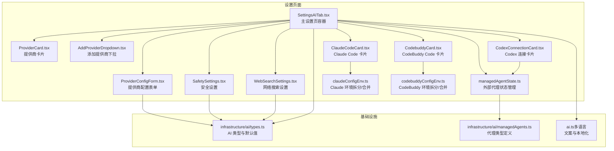
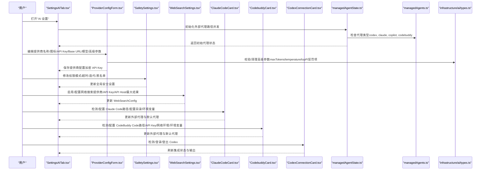
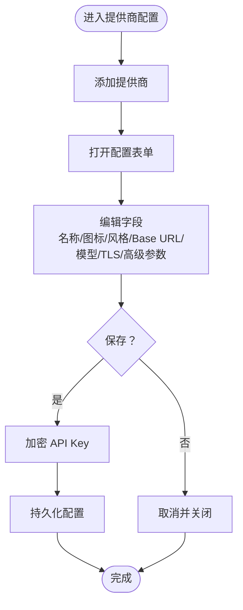
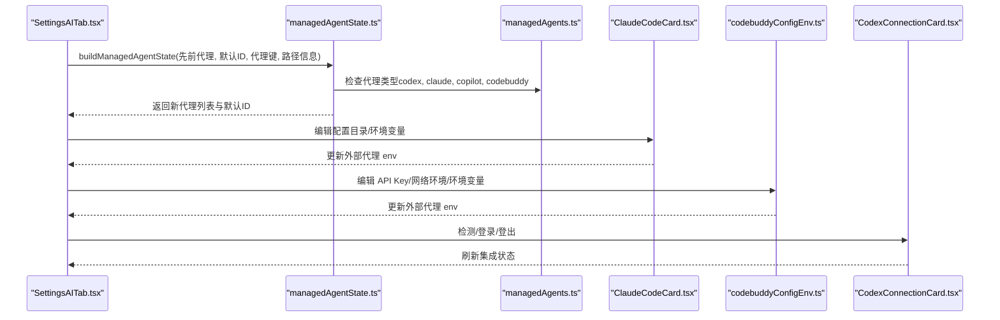
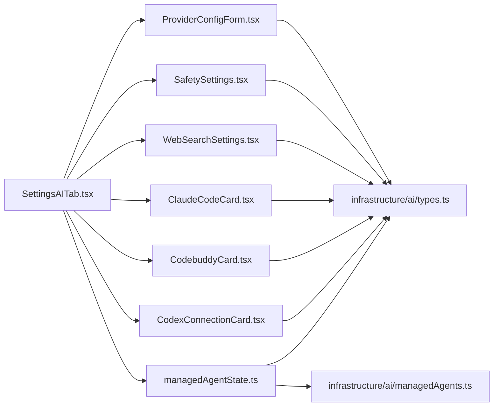

# AI设置

<cite>
**本文引用的文件**
- [SettingsAITab.tsx](file://components/settings/tabs/SettingsAITab.tsx)
- [types.ts](file://components/settings/tabs/ai/types.ts)
- [ProviderCard.tsx](file://components/settings/tabs/ai/ProviderCard.tsx)
- [ProviderConfigForm.tsx](file://components/settings/tabs/ai/ProviderConfigForm.tsx)
- [AddProviderDropdown.tsx](file://components/settings/tabs/ai/AddProviderDropdown.tsx)
- [SafetySettings.tsx](file://components/settings/tabs/ai/SafetySettings.tsx)
- [WebSearchSettings.tsx](file://components/settings/tabs/ai/WebSearchSettings.tsx)
- [managedAgentState.ts](file://components/settings/tabs/ai/managedAgentState.ts)
- [claudeConfigEnv.ts](file://components/settings/tabs/ai/claudeConfigEnv.ts)
- [codebuddyConfigEnv.ts](file://components/settings/tabs/ai/codebuddyConfigEnv.ts)
- [ClaudeCodeCard.tsx](file://components/settings/tabs/ai/ClaudeCodeCard.tsx)
- [CodexConnectionCard.tsx](file://components/settings/tabs/ai/CodexConnectionCard.tsx)
- [CodebuddyCard.tsx](file://components/settings/tabs/ai/CodebuddyCard.tsx)
- [managedAgents.ts](file://infrastructure/ai/managedAgents.ts)
- [types.ts](file://infrastructure/ai/types.ts)
- [ai.ts（简体中文）](file://application/i18n/locales/zh-CN/ai.ts)
- [ai.ts（英语）](file://application/i18n/locales/en/ai.ts)
- [ai.ts（俄语）](file://application/i18n/locales/ru/ai.ts)
</cite>

## 目录
1. [简介](#简介)
2. [项目结构](#项目结构)
3. [核心组件](#核心组件)
4. [架构总览](#架构总览)
5. [详细组件分析](#详细组件分析)
6. [依赖关系分析](#依赖关系分析)
7. [性能考虑](#性能考虑)
8. [故障排除指南](#故障排除指南)
9. [结论](#结论)
10. [附录](#附录)

## 简介
本指南面向使用者，系统讲解 Netcatty 的 AI 设置功能，涵盖以下方面：
- AI 提供商配置：添加、删除、编辑与启用，支持 OpenAI、Anthropic（Claude）、Google、Ollama、OpenRouter、Custom 等。
- 模型选择与参数：默认模型、高级参数（温度、最大令牌数、top_p、频率/出现惩罚）。
- 权限与安全：全局权限模式、工具接入模式、命令黑名单、命令超时、最大迭代次数。
- AI 代理配置：默认代理、外部代理（Codex、Claude Code、GitHub Copilot CLI、CodeBuddy Code）的检测与配置。
- AI 搜索设置：网络搜索提供商、API Key、API Host、最大结果数。
- 故障排除与性能优化建议。

## 项目结构
AI 设置位于"设置"页面的"AI"标签页，UI 由多个子组件构成，并通过基础设施层的类型与默认值进行统一管理。

**更新** 新增了CodeBuddy Code代理支持，包括CodebuddyCard组件和相关配置功能。

**章节来源**
- [SettingsAITab.tsx:1-823](file://components/settings/tabs/SettingsAITab.tsx#L1-L823)
- [ProviderCard.tsx:1-105](file://components/settings/tabs/ai/ProviderCard.tsx#L1-L105)
- [ProviderConfigForm.tsx:1-461](file://components/settings/tabs/ai/ProviderConfigForm.tsx#L1-L461)
- [AddProviderDropdown.tsx:1-56](file://components/settings/tabs/ai/AddProviderDropdown.tsx#L1-L56)
- [SafetySettings.tsx:1-205](file://components/settings/tabs/ai/SafetySettings.tsx#L1-L205)
- [WebSearchSettings.tsx:1-221](file://components/settings/tabs/ai/WebSearchSettings.tsx#L1-L221)
- [ClaudeCodeCard.tsx:1-162](file://components/settings/tabs/ai/ClaudeCodeCard.tsx#L1-L162)
- [CodexConnectionCard.tsx:1-210](file://components/settings/tabs/ai/CodexConnectionCard.tsx#L1-L210)
- [CodebuddyCard.tsx:1-186](file://components/settings/tabs/ai/CodebuddyCard.tsx#L1-L186)
- [managedAgentState.ts:1-78](file://components/settings/tabs/ai/managedAgentState.ts#L1-L78)
- [claudeConfigEnv.ts:1-66](file://components/settings/tabs/ai/claudeConfigEnv.ts#L1-L66)
- [codebuddyConfigEnv.ts:1-67](file://components/settings/tabs/ai/codebuddyConfigEnv.ts#L1-L67)
- [managedAgents.ts:1-78](file://infrastructure/ai/managedAgents.ts#L1-L78)
- [types.ts:1-348](file://infrastructure/ai/types.ts#L1-L348)

## 核心组件
- 设置主容器：负责聚合提供商、代理、安全与搜索设置，处理外部代理路径检测与默认代理选择。
- 提供商卡片与表单：支持添加、编辑、启用/禁用提供商，配置名称、图标、协议风格、Base URL、默认模型、TLS 跳过、高级参数等。
- 安全设置：全局权限模式（观察者/确认/自主）、命令超时、最大迭代次数、命令黑名单（正则）。
- 网络搜索设置：启用开关、提供商选择、API Key（加密存储）、API Host、最大结果数。
- 外部代理卡片：Codex CLI、Claude Code、GitHub Copilot CLI、CodeBuddy Code 的路径检测、登录/登出、配置目录与环境变量编辑。
- 外部代理状态管理：根据系统路径发现结果动态生成/更新外部代理条目，维护默认代理 ID。

**更新** 新增了CodeBuddy Code代理卡片，支持通过ACP协议集成CodeBuddy Code，包括路径检测、API密钥配置、网络环境设置和环境变量编辑功能。

**章节来源**
- [SettingsAITab.tsx:90-823](file://components/settings/tabs/SettingsAITab.tsx#L90-L823)
- [ProviderCard.tsx:11-105](file://components/settings/tabs/ai/ProviderCard.tsx#L11-L105)
- [ProviderConfigForm.tsx:50-461](file://components/settings/tabs/ai/ProviderConfigForm.tsx#L50-L461)
- [SafetySettings.tsx:9-205](file://components/settings/tabs/ai/SafetySettings.tsx#L9-L205)
- [WebSearchSettings.tsx:33-221](file://components/settings/tabs/ai/WebSearchSettings.tsx#L33-L221)
- [ClaudeCodeCard.tsx:10-162](file://components/settings/tabs/ai/ClaudeCodeCard.tsx#L10-L162)
- [CodexConnectionCard.tsx:9-210](file://components/settings/tabs/ai/CodexConnectionCard.tsx#L9-L210)
- [CodebuddyCard.tsx:16-186](file://components/settings/tabs/ai/CodebuddyCard.tsx#L16-L186)
- [managedAgentState.ts:29-78](file://components/settings/tabs/ai/managedAgentState.ts#L29-L78)

## 架构总览
AI 设置采用"设置容器 + 子组件 + 基础设施类型"的分层设计。设置容器负责状态与桥接调用（如外部代理路径检测、Codex 登录状态刷新），子组件负责具体 UI 与输入校验，基础设施类型定义数据结构与默认值，多语言文案贯穿 UI。

**更新** 新增了CodeBuddy Code代理的检测和配置流程。

**图表来源**
- [SettingsAITab.tsx:201-263](file://components/settings/tabs/SettingsAITab.tsx#L201-L263)
- [ProviderConfigForm.tsx:142-173](file://components/settings/tabs/ai/ProviderConfigForm.tsx#L142-L173)
- [SafetySettings.tsx:57-62](file://components/settings/tabs/ai/SafetySettings.tsx#L57-L62)
- [WebSearchSettings.tsx:77-114](file://components/settings/tabs/ai/WebSearchSettings.tsx#L77-L114)
- [ClaudeCodeCard.tsx:31-162](file://components/settings/tabs/ai/ClaudeCodeCard.tsx#L31-L162)
- [CodebuddyCard.tsx:61-186](file://components/settings/tabs/ai/CodebuddyCard.tsx#L61-L186)
- [CodexConnectionCard.tsx:40-210](file://components/settings/tabs/ai/CodexConnectionCard.tsx#L40-L210)
- [managedAgentState.ts:29-78](file://components/settings/tabs/ai/managedAgentState.ts#L29-L78)
- [managedAgents.ts:3-10](file://infrastructure/ai/managedAgents.ts#L3-L10)
- [types.ts:15-40](file://infrastructure/ai/types.ts#L15-L40)

## 详细组件分析

### 提供商配置（添加、删除、编辑、启用）
- 添加提供商：从预设集合中选择提供商类型，生成唯一 ID 并自动打开配置表单。
- 删除提供商：带确认提示，移除后若处于编辑态则关闭编辑。
- 编辑提供商：支持名称、图标（内置图标或上传自定义）、协议风格（OpenAI/Anthropic/Google）、Base URL、默认模型、TLS 跳过、高级参数（maxTokens、temperature、topP、frequency_penalty、presence_penalty）。
- 加密存储：API Key 在保存前加密，读取时解密展示。
- 默认模型选择：基于提供商类型与 Base URL 调用模型列表接口（部分提供商预设了模型端点）。

**图表来源**
- [AddProviderDropdown.tsx:10-56](file://components/settings/tabs/ai/AddProviderDropdown.tsx#L10-L56)
- [ProviderCard.tsx:11-105](file://components/settings/tabs/ai/ProviderCard.tsx#L11-L105)
- [ProviderConfigForm.tsx:50-461](file://components/settings/tabs/ai/ProviderConfigForm.tsx#L50-L461)
- [types.ts:23-40](file://infrastructure/ai/types.ts#L23-L40)

**章节来源**
- [AddProviderDropdown.tsx:10-56](file://components/settings/tabs/ai/AddProviderDropdown.tsx#L10-L56)
- [ProviderCard.tsx:11-105](file://components/settings/tabs/ai/ProviderCard.tsx#L11-L105)
- [ProviderConfigForm.tsx:50-461](file://components/settings/tabs/ai/ProviderConfigForm.tsx#L50-L461)
- [types.ts:296-304](file://infrastructure/ai/types.ts#L296-L304)

### 模型选择与参数设置
- 模型选择：根据 Base URL 与提供商类型调用对应模型端点，支持搜索/筛选与分页加载。
- 高级参数：maxTokens（>0）、temperature（0–2）、topP（0–1）、frequency_penalty（-2–2）、presence_penalty（-2–2），保存前进行数值范围校验与清洗。
- 协议风格：可覆盖默认风格（OpenAI/Anthropic/Google），用于适配第三方兼容端点。

**章节来源**
- [ProviderConfigForm.tsx:336-349](file://components/settings/tabs/ai/ProviderConfigForm.tsx#L336-L349)
- [ProviderConfigForm.tsx:100-115](file://components/settings/tabs/ai/ProviderConfigForm.tsx#L100-L115)
- [types.ts:15-21](file://infrastructure/ai/types.ts#L15-L21)
- [types.ts:42-53](file://infrastructure/ai/types.ts#L42-L53)

### 权限管理与安全设置
- 全局权限模式：
  - 观察者：只读，禁止写操作（对内置与 ACP Agent 均生效）。
  - 确认：操作前询问（对 ACP Agent 为建议性，因其有自身工具审批流程）。
  - 自主：自由执行。
- 工具接入模式：MCP（暴露内置服务器）或 Skills + CLI（引导 Agent 读取本地 Skill 与 CLI）。
- 命令超时：秒级限制，超时终止（对内置与 ACP Agent 均生效）。
- 最大迭代次数：防止失控循环（ACP Agent 可能有自身限制）。
- 命令黑名单：正则表达式列表，拦截危险命令（通过 Netcatty 执行层对内置与 ACP Agent 生效）。

**章节来源**
- [SafetySettings.tsx:9-205](file://components/settings/tabs/ai/SafetySettings.tsx#L9-L205)
- [types.ts:178-189](file://infrastructure/ai/types.ts#L178-L189)
- [types.ts:264-294](file://infrastructure/ai/types.ts#L264-L294)

### AI 代理配置（默认代理与外部代理）
- 默认代理：内置 Catty 或已检测到的外部代理（Codex、Claude Code、Copilot、CodeBuddy）。
- 外部代理检测：启动时并发解析各代理路径，若可用则自动注册为"discovered_xxx"代理，并更新默认代理 ID。
- Claude Code：支持配置目录（CLAUDE_CONFIG_DIR）与环境变量编辑（保留 CLAUDE_CODE_EXECUTABLE）。
- CodeBuddy：支持 API Key（CODEBUDDY_API_KEY）与网络环境（CODEBUDDY_INTERNET_ENVIRONMENT）编辑。
- Codex：支持路径检测、ChatGPT 登录、API Key 登录、自定义配置（config.toml）与登出。

**更新** 新增了CodeBuddy代理类型的检测和配置流程。

**图表来源**
- [SettingsAITab.tsx:201-263](file://components/settings/tabs/SettingsAITab.tsx#L201-L263)
- [managedAgentState.ts:29-78](file://components/settings/tabs/ai/managedAgentState.ts#L29-L78)
- [managedAgents.ts:3-10](file://infrastructure/ai/managedAgents.ts#L3-L10)
- [claudeConfigEnv.ts:32-66](file://components/settings/tabs/ai/claudeConfigEnv.ts#L32-L66)
- [codebuddyConfigEnv.ts:32-67](file://components/settings/tabs/ai/codebuddyConfigEnv.ts#L32-L67)
- [ClaudeCodeCard.tsx:31-162](file://components/settings/tabs/ai/ClaudeCodeCard.tsx#L31-L162)
- [CodexConnectionCard.tsx:40-210](file://components/settings/tabs/ai/CodexConnectionCard.tsx#L40-L210)

**章节来源**
- [SettingsAITab.tsx:132-192](file://components/settings/tabs/SettingsAITab.tsx#L132-L192)
- [managedAgentState.ts:13-78](file://components/settings/tabs/ai/managedAgentState.ts#L13-L78)
- [managedAgents.ts:3-10](file://infrastructure/ai/managedAgents.ts#L3-L10)
- [claudeConfigEnv.ts:12-66](file://components/settings/tabs/ai/claudeConfigEnv.ts#L12-L66)
- [codebuddyConfigEnv.ts:12-67](file://components/settings/tabs/ai/codebuddyConfigEnv.ts#L12-L67)
- [ClaudeCodeCard.tsx:10-162](file://components/settings/tabs/ai/ClaudeCodeCard.tsx#L10-L162)
- [CodexConnectionCard.tsx:9-210](file://components/settings/tabs/ai/CodexConnectionCard.tsx#L9-L210)

### CodeBuddy Code 代理配置
- 路径检测：支持自动检测 PATH 中的 codebuddy 可执行文件，或手动指定自定义路径。
- 认证配置：支持设置 CODEBUDDY_API_KEY 环境变量进行 API 认证。
- 网络环境：支持设置 CODEBUDDY_INTERNET_ENVIRONMENT 环境变量，包括默认（海外）、Internal、IOA 三种选项。
- 环境变量编辑：支持编辑其他环境变量，所有配置以 KEY=VALUE 形式存储在外部代理配置中。
- 状态显示：显示检测状态（检测中/已检测到/未找到），并提供重新检查按钮。

**新增** CodeBuddy Code 代理的完整配置功能。

**章节来源**
- [CodebuddyCard.tsx:16-186](file://components/settings/tabs/ai/CodebuddyCard.tsx#L16-L186)
- [codebuddyConfigEnv.ts:32-67](file://components/settings/tabs/ai/codebuddyConfigEnv.ts#L32-L67)
- [SettingsAITab.tsx:172-192](file://components/settings/tabs/SettingsAITab.tsx#L172-L192)

### AI 搜索设置（网络搜索）
- 启用/禁用：开关控制是否允许 AI 代理进行网络搜索。
- 提供商：Tavily、Exa、Bocha、Zhipu、SearXNG，部分需要 API Key，SearXNG 需要 API Host。
- API Key：加密存储；失焦时异步加密并落盘，避免竞态。
- API Host：自定义端点（SearXNG 必填）。
- 最大结果数：1–20。

**章节来源**
- [WebSearchSettings.tsx:33-221](file://components/settings/tabs/ai/WebSearchSettings.tsx#L33-L221)
- [types.ts:232-262](file://infrastructure/ai/types.ts#L232-L262)

## 依赖关系分析
- 设置容器依赖外部桥接能力（如代理路径检测、Codex 登录、用户 Skills 状态）。
- 子组件依赖基础设施类型（ProviderConfig、AISettings、WebSearchConfig、ExternalAgentConfig 等）。
- 安全设置与代理设置共同作用于执行层（MCP Server），对内置与 ACP Agent 生效。

**更新** 新增了CodebuddyCard.tsx和managedAgents.ts的依赖关系。

**图表来源**
- [SettingsAITab.tsx:90-823](file://components/settings/tabs/SettingsAITab.tsx#L90-L823)
- [ProviderConfigForm.tsx:1-461](file://components/settings/tabs/ai/ProviderConfigForm.tsx#L1-L461)
- [SafetySettings.tsx:1-205](file://components/settings/tabs/ai/SafetySettings.tsx#L1-L205)
- [WebSearchSettings.tsx:1-221](file://components/settings/tabs/ai/WebSearchSettings.tsx#L1-L221)
- [ClaudeCodeCard.tsx:1-162](file://components/settings/tabs/ai/ClaudeCodeCard.tsx#L1-L162)
- [CodebuddyCard.tsx:1-186](file://components/settings/tabs/ai/CodebuddyCard.tsx#L1-L186)
- [CodexConnectionCard.tsx:1-210](file://components/settings/tabs/ai/CodexConnectionCard.tsx#L1-L210)
- [managedAgentState.ts:1-78](file://components/settings/tabs/ai/managedAgentState.ts#L1-L78)
- [managedAgents.ts:1-78](file://infrastructure/ai/managedAgents.ts#L1-L78)
- [types.ts:1-348](file://infrastructure/ai/types.ts#L1-L348)

**章节来源**
- [SettingsAITab.tsx:90-823](file://components/settings/tabs/SettingsAITab.tsx#L90-L823)
- [types.ts:1-348](file://infrastructure/ai/types.ts#L1-L348)

## 性能考虑
- 外部代理路径检测并发执行，减少初始化等待时间。
- 高级参数保存前进行范围校验与整数化，降低运行期异常概率。
- WebSearch API Key 加密采用异步序列号机制，避免回调乱序导致的状态错乱。
- 命令超时与最大迭代次数限制可有效防止长时间占用与失控循环。

## 故障排除指南
- Codex 登录失败或"主进程处理器未加载"：
  - 重启应用或 Electron 开发进程，确保主进程桥接已加载后再尝试。
  - 若使用自定义配置（config.toml），检查所需环境变量是否在当前 Shell 中导出。
- Claude Code 未找到或鉴权失败：
  - 确认已安装 CLI 并在 PATH 中；或在"自定义路径"中指定可执行文件。
  - 使用"配置目录"设置 CLAUDE_CONFIG_DIR，避免在界面直接粘贴敏感凭据。
- CodeBuddy 无法鉴权：
  - 在"API Key"处填写 CODEBUDDY_API_KEY，或在 Shell 环境中设置。
  - 如受限网络，选择合适的 Internet Environment（Internal/IOA）。
- CodeBuddy 代理检测问题：
  - 确认 codebuddy 可执行文件存在于 PATH 中，或在自定义路径中指定正确的可执行文件。
  - 检查网络环境设置是否正确，特别是在受限网络环境中。
  - 验证环境变量配置格式是否正确（KEY=VALUE 形式）。
- 网络搜索不可用：
  - 检查提供商是否需要 API Key，以及 API Host 是否正确（SearXNG 必填）。
  - 确认最大结果数在 1–20 范围内。
- 命令被拦截或超时：
  - 检查命令黑名单正则是否误伤；必要时重置为默认。
  - 调整命令超时与最大迭代次数，平衡安全性与可用性。

**更新** 新增了CodeBuddy代理相关的故障排除指南。

**章节来源**
- [CodexConnectionCard.tsx:40-210](file://components/settings/tabs/ai/CodexConnectionCard.tsx#L40-L210)
- [ClaudeCodeCard.tsx:31-162](file://components/settings/tabs/ai/ClaudeCodeCard.tsx#L31-L162)
- [CodebuddyCard.tsx:61-186](file://components/settings/tabs/ai/CodebuddyCard.tsx#L61-L186)
- [codebuddyConfigEnv.ts:32-67](file://components/settings/tabs/ai/codebuddyConfigEnv.ts#L32-L67)
- [WebSearchSettings.tsx:77-114](file://components/settings/tabs/ai/WebSearchSettings.tsx#L77-L114)
- [SafetySettings.tsx:57-62](file://components/settings/tabs/ai/SafetySettings.tsx#L57-L62)

## 结论
本指南从使用者角度梳理了 Netcatty 的 AI 设置功能，覆盖提供商、模型参数、权限安全、代理与网络搜索等关键领域。通过合理配置权限模式、命令超时与黑名单，结合外部代理的路径检测与环境变量管理，可在保证安全的前提下提升 AI 辅助开发与运维的效率。

**更新** 新增了对 CodeBuddy Code 代理的支持，进一步丰富了 AI 代理生态系统，为用户提供更多选择和更灵活的配置选项。

## 附录
- 多语言文案：简体中文、英语、俄语均提供完整文案，便于国际化部署与用户理解。
- 默认设置：提供合理的默认值（如默认代理、命令超时、最大迭代次数），降低首次使用门槛。
- 代理类型扩展：支持的代理类型包括 codex、claude、copilot、codebuddy，满足不同用户的 AI 代理需求。

**更新** 新增了对新增代理类型（codebuddy）的支持说明。

**章节来源**
- [ai.ts（简体中文）:1-271](file://application/i18n/locales/zh-CN/ai.ts#L1-L271)
- [ai.ts（英语）:1-271](file://application/i18n/locales/en/ai.ts#L1-L271)
- [ai.ts（俄语）:1-271](file://application/i18n/locales/ru/ai.ts#L1-L271)
- [types.ts:283-294](file://infrastructure/ai/types.ts#L283-L294)
- [managedAgents.ts:3-10](file://infrastructure/ai/managedAgents.ts#L3-L10)